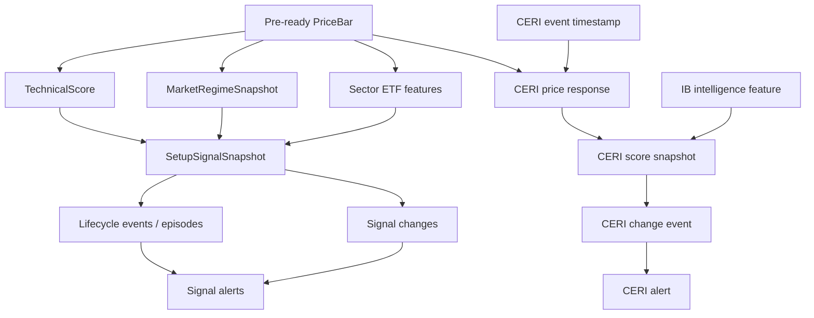

# SwingLens session and temporal integrity forensic certification

Date: 2026-09-07 (Europe/Zurich)

Forensic branch: `codex/session-temporal-integrity-forensics`

Audited commit: `1f6b1098136cfb1931fc1838b01dc2b3bbe40662`
Prompt reference commit: `f6be50aa8b64ddb3fe4a0fa9892066551e9744d9` (not checked out)

The SRS and SDD supplied with the task were treated as proposed requirements and design, not as evidence about current behavior. No production remediation is included in this branch.

## A. Executive summary

Eighteen findings were checked: the seventeen proposed findings plus one newly discovered adjacent finding. Fourteen are `CONFIRMED`; four are `PARTIALLY_CONFIRMED`; none are `NOT_REPRODUCED`, `NOT_APPLICABLE`, or `UNRESOLVED`.

The final pipeline canary is **not safe now: NO**. Normal technical scoring, Market Regime, optional Sector ETF scoring, Setup Lifecycle, CERI feature/capture, and IB Market Intelligence do not share one immutable knowledge cutoff and eligible session. Production history proves 1,122 technical scores consumed a ticker daily bar one completed session too new, and 2,705 CERI price-response features begin at an open before their event timestamp.

The strongest historical results are:

- 2,306 daily `PriceBar` rows (1,153 adjusted and 1,153 trades) were first seen before their session's safe daily-bar boundary.
- 1,122 `TechnicalScore` rows across eight runs ended one session beyond the expected completed session. A read-only reconstruction of score 7,224 (`JBS`) changed 99 latest technical feature values when the extra bar was removed.
- 1,207 technical scores had reconstructed ticker versus SPY/QQQ ending-session mismatches: 790 had both peers behind the ticker and 417 had both peers ahead. These are potential, not certified consumed-session mismatches, because peer sessions were not persisted and a peer row could have arrived between frame load and score persistence.
- No Market Regime snapshot consumed a session beyond its calculation-time boundary in retained history, and SPY/QQQ were aligned in all 88 snapshots. Three snapshots nevertheless stored a false stale flag from calendar-day arithmetic; their persisted aggregate risk state remained Orange.
- All 87 retained Sector Rotation snapshots used `universe_only`; ETF confirmation was disabled. The vulnerable inner ETF loader is therefore reachable by configuration but has no retained historical contamination.
- 390 Setup Lifecycle snapshots have `data_as_of_date` later than the defensible completed session: 375 are one trading session ahead and 15 carry a non-session weekend date. Their lineage reaches 607 lifecycle events, 6,233 signal changes (either side), 161 alerts through either event path, and 141 episodes. These are downstream *potential impact* counts, not declarations that every row changed.
- 8,319 CERI score snapshots label a session later than the session completed at `cutoff_at`; 5,080 are one trading session ahead and 3,239 are non-session calendar labels. Of all score snapshots, 137 prove consumption of a price bar beyond the completed-session boundary.
- 2,705 of 5,782 CERI price responses are pre-event contaminated (2,704 catalyst, one earnings). There are 5,677 timestamp-resolvable rows, 105 unresolved rows, 2,962 pre-market-safe rows, and 10 exact-open equality rows. Contaminated feature IDs appear in 4,700 score-snapshot lineages; 318 snapshots actually score an available price-response component using one of them.
- 97 persisted CERI alerts would have had a different cooldown decision when endpoints are first mapped to New York effective sessions. Suppressed alerts leave no row, so the full counterfactual population cannot be recovered.
- 6,808 persisted technical scores deterministically used the week before an already completed weekly bucket; 16,913 selected the prior week while the latest bucket was still partial; 145 lack sufficient debug lineage.
- Both retained IB Market Intelligence historical requests specified 60 calendar days, totaling 120 calendar dates for 80 exchange sessions and 40 non-session dates. Post-filtering prevented out-of-range persistence, but one MSFT BID_ASK daily bar dated 2026-08-10 was persisted at 13:36 New York—before close—and all eight retained IB intelligence features have calendar-derived `as_of_session` later than the completed session.

Machine-readable results are in `artifacts/forensics/session_integrity_summary.json`; bounded row manifests are in the adjacent CSV files. Large sets are represented by sorted-ID SHA-256 hashes. The reproducer is `scripts/forensics/session_temporal_integrity_audit.py`, which asserts `transaction_read_only=on` for every database query.

## Baseline and operational preservation

### Before

| Item | Value |
| --- | --- |
| Git commit | `1f6b1098136cfb1931fc1838b01dc2b3bbe40662` |
| Git branch | `main` |
| Working tree | clean; `## main...origin/main` |
| Alembic head | `0067_worker_quiesce` |
| PostgreSQL identity | database `swinglens`; user `postgres`; `127.0.0.1:5432`; PostgreSQL 18.3 |
| PostgreSQL timezone | `Europe/Berlin` |
| Application running | no |
| Worker running | no (the latest worker registry heartbeat was stale and had no OS process or DB session) |
| Executing active jobs | 0 |
| Nonterminal blocked jobs | 1 |
| Queued jobs | 0 |
| Local time | `2026-09-07T22:56:58.898093+02:00` (`Europe/Zurich`) |
| UTC time | `2026-09-07T20:56:58.898093+00:00` |
| New York time | `2026-09-07T16:56:58.898093-04:00` |
| Latest completed US session | `2026-09-04` (2026-09-07 was Labor Day) |

The actual commit differs from the prompt reference. The intervening commits are `9274014`, `ab61413`, `b14dab7`, `5fdbde4`, and `1f6b109`; the last two concern lifecycle behavior. The worktree was not reset or checked out to the older commit.

Relevant before counts: 147 upload runs; 140 pipeline runs; 1,235 pipeline steps; 2,262,368 price bars; 34,244 price-bar revisions; 2,972 series versions; 8,894 technical artifacts; 23,866 technical scores; 88 Market Regime snapshots; 87 Sector Rotation snapshots; 26,523 Setup Lifecycle snapshots; 31,945 lifecycle events; 148,511 signal changes; 4,021 signal alerts; 57,071 CERI processing runs; 23,835 CERI derived features; 5,782 CERI price responses; 10,718 CERI score snapshots; 9,852 CERI changes; 1,057 CERI alerts; 11 IB intelligence runs; 20 request items; and 80 historical metric bars.

### After

Captured at `2026-09-08T00:12:09.215435+02:00` local / `2026-09-07T22:12:09.215435+00:00` UTC / `2026-09-07T18:12:09.215435-04:00` New York:

- application running: no; worker running: no;
- executing active jobs: 0; nonterminal blocked: 1; queued: 0;
- Alembic head: unchanged at `0067_worker_quiesce`;
- latest completed US session: unchanged at `2026-09-04`;
- other sessions connected to database `swinglens`: 0 active and 0 idle;
- every relevant row count listed above is byte-for-byte numerically unchanged, including 2,262,368 price bars, 23,866 technical scores, 26,523 lifecycle snapshots, 23,835 CERI derived features, 5,782 CERI price responses, 10,718 CERI score snapshots, and 80 IB historical metric bars.

Only a forensic branch, local files, and disposable test databases were changed. No production migrations, jobs, pipelines, providers, rebuilds, publication, or business-table writes occurred.

## Shared US market calendar certification

`app/services/us_market_calendar.py` is internally consistent for the audited 2026 range:

- timezone: `America/New_York`;
- regular open: 09:30; regular close: 16:00;
- configured daily-bar readiness delay: 15 minutes;
- exact readiness boundary is eligible (`>=`);
- exact open is not “strictly after” for `first_us_market_open_after`, so the next session is returned;
- regular and early exact close remain in the same `us_market_session` object;
- weekends and recurring observed holidays are excluded;
- the cross-year New Year observation correctly excludes 2021-12-31;
- 2026-11-27 and 2026-12-24 close at 13:00; 2026-07-03 is an observed holiday, not an early-close session;
- New York offsets stay `-04:00` through the March and autumn US/Europe DST gaps and switch to `-05:00` after the US autumn transition.

The 2025-2027 holiday and early-close rules agree with the NYSE's published schedule: <https://www.nyse.com/markets/hours-calendars>. The calendar is rule-based and does not carry an authoritative table of extraordinary closures or emergency halts. That limitation does not affect the July-September 2026 historical counts in this report, but it prevents an all-years certification without an exchange-calendar dataset. Naive datetime input to `_ny_datetime` is also assumed to be New York time; callers should not rely on that implicit contract.

## Session-semantics inventory

The full production inventory is in `artifacts/forensics/session_semantics_inventory.csv`. It covers the shared calendar, bounded and unbounded OHLCV loaders, technical/cache/HTF/RS, Market Regime, Sector Rotation, Setup Lifecycle, CERI, IB Market Intelligence, pipeline orchestration, and the safe Winner comparison paths. The initial repository-wide scan produced 1,762 time/session token occurrences; the inventory collapses persistence-only and display-only occurrences into the market-sensitive transformations that require review.

## B. Finding-by-finding table

| ID | Status | Code vulnerability | Runtime reachable | Historical contamination count | Severity | Action |
| --- | --- | ---: | ---: | --- | --- | --- |
| STI-F001 | CONFIRMED | yes | yes | 1,122 scores / 8 runs | Critical | Freeze session; bound every technical load; add worker assertion |
| STI-F002 | CONFIRMED | yes | yes | 1,207 reconstructed mismatches; exact consumed peer sessions unavailable | High | Persist and enforce run-wide source sessions |
| STI-F003 | PARTIALLY_CONFIRMED | yes | bounded reuse not currently called | 363 ahead artifacts, all `UNVALIDATED`; 0 ahead active `MATCH` artifacts | High | Add cutoff/session to key and namespace old cache |
| STI-F004 | CONFIRMED | yes | yes | 0 retained ahead inputs; 0 SPY/QQQ mismatches | High | Bound inputs despite clean retained sample |
| STI-F005 | CONFIRMED | yes | yes | 3 false-stale snapshots | Medium | Replace `.days` with session arithmetic |
| STI-F006 | PARTIALLY_CONFIRMED | yes when ETF mode enabled | config-reachable; disabled now | 0 of 87 retained snapshots (all `universe_only`) | Medium | Bound inner ETF loads before enabling mode |
| STI-F007 | CONFIRMED | yes | yes | 390 snapshots; 375 one-session ahead | High | Resolve completed session from timestamp cutoff |
| STI-F008 | CONFIRMED | yes | yes | 23,152 derived rows and 4,725 build states carry later calendar labels; default-path attribution incomplete | High | Require explicit cutoff context; persist processing lineage |
| STI-F009 | CONFIRMED | yes | yes | 8,319 score labels later than completed session; 137 source-bar-ahead snapshots | High | Stop deriving session with `cutoff_at.date()` |
| STI-F010 | CONFIRMED | yes | yes | 2,705 price-response features | Critical | Separate event bucket from causal reaction start |
| STI-F011 | PARTIALLY_CONFIRMED | usage-dependent | yes | included in F010; 10 exact-open rows | High for reaction | Version policies; next session for daily reaction at open/close |
| STI-F012 | CONFIRMED | yes | yes | 97 persisted alert decisions differ | High | Map endpoints to effective sessions first |
| STI-F013 | CONFIRMED | yes | yes | 6,808 stale-by-one-week score rows | High | Use calendar-proven weekly completion |
| STI-F014 | PARTIALLY_CONFIRMED | generic timestamp API yes | not via current PriceBar frames | 0 proven production rows | Low/Medium | Preserve dates; timezone-contract timestamp inputs |
| STI-F015 | CONFIRMED | yes | yes | 1 pre-ready historical metric bar; 40 non-session requested dates | High | Resolve session end and record raw/provider scope |
| STI-F016 | CONFIRMED | yes | yes | provenance classifications below | High | Add first-class temporal lineage |
| STI-F017 | CONFIRMED | yes | yes | exact cross-stage history unprovable; architecture permits drift | Critical | Freeze one cutoff at pipeline start |
| STI-F018 | CONFIRMED | yes | yes | all 8 retained IB intelligence features | High | Derive feature `as_of_session` from market cutoff |

## C. Detailed evidence

### STI-F001 — normal/live technical scoring boundary — CONFIRMED

**Code.** Winner-only `load_winner_point_in_time_technical_frames` (`technical_score_service.py:71`) supplies both `max_session` and `as_of`. Normal `score_run_technicals` (`:99`), the sequential ticker path (`:768`), process path (`:862`), legacy path (`:1376`), and `_load_price_frame` (`:1562`) call `load_preferred_ohlcv_frames` without either bound. The repository supports both optional bounds (`price_bar_repository.py:10-73`), proving this is a caller defect rather than a missing storage capability. `TechnicalWorkItem` has no cutoff/session field, and workers assert no ending-session invariant.

**Reachability and historical proof.** Production contains 2,306 daily bars first seen before the safe boundary, split evenly across adjusted and trades series. The technical debug ending date exceeds `latest_completed_us_trading_day(created_at)` for 1,122 rows in runs 57, 60, 68, 72, 73, 77, 120, and 128. Every excess is one exchange session. Stable affected-ID hash: `82a2468efa2671ecf92c142bb89c62e9952f47e5daf1cf4800d594d4ad9577f8`.

Score 7,224 (`JBS`, run 57) was reconstructed with `as_of=2026-07-27T20:21:20+02:00`. Unbounded data ended 2026-07-27; the safe bound ended 2026-07-24. Removing the extra row changed 99 latest feature values, including ATR, ADX, Bollinger width, adaptive percentiles, breakout state/quality, volume percentiles, stage and risk fields. HTF values also changed. Exact persisted final-score equality cannot be certified because run-wide peer-frame versions and the calculation configuration instance were not persisted.

**Blast radius.** Base trend/momentum, adaptive percentile, volatility-contraction, Donchian/Darvas/box, stage, climax, HTF, relative-strength, beta-adjusted leadership, scoring, classification, and downstream lifecycle consumers may change.

### STI-F002 — ticker/SPY/QQQ/sector coherence — CONFIRMED

The ticker, SPY, QQQ, and configured sector benchmark are loaded independently with no shared eligible session. The current `sectorSymbol` is QQQ, so sector confirmation duplicates the QQQ frame rather than a per-sector ETF in normal technical scoring. A long scoring run can observe a frame revision or new bar between these loads. The overlap runner detects changed *market frame signatures* and may resubmit ticker work, but the signature is not an eligible-session contract and does not prevent all sources from coherently advancing beyond the intended cutoff.

Using first-seen dates as a reconstruction bound, 22,514 score rows have aligned ticker/SPY/QQQ end dates, 790 have SPY and QQQ behind the ticker, 417 have both ahead, and 145 lack ticker debug lineage. No one-source-only mismatch was found. These counts prove inconsistent availability by score persistence, but not the exact peer frame consumed: peer source sessions and bar IDs are absent, and a peer bar may have arrived after the initial peer load. Historical source-session state is therefore *potentially affected with insufficient exact lineage*, not “proven invalid” solely from this reconstruction.

### STI-F003 — technical artifact cache temporal identity — PARTIALLY_CONFIRMED

`build_local_artifact_key` (`technical_artifact_cache.py:44`) includes ticker, timeframe, adjusted/trades series versions, feature/config hashes, engine version, and schema version. It contains neither eligible session nor cutoff. Therefore the proposed `S+1` series / artifact versus later bound `S` key collision is structurally possible.

The exact active scenario is not presently reached: normal technical scoring is unbounded, while the Winner bounded loader does not use this cache. Active reads require `READY` plus `shadow_validation_status=MATCH`, but shadow validation compares against another unbounded fresh calculation and cannot certify a future bounded caller. Runtime configuration is `ACTIVE`. Retained artifacts: 468 aligned `MATCH`, one behind `MATCH`, 8,039 aligned unvalidated, 23 behind unvalidated, and 363 ahead unvalidated. Thus zero ahead artifacts are active-certified, while the key design remains unsafe for the proposed bounded architecture.

### STI-F004 — Market Regime unbounded inputs — CONFIRMED

`MarketRegimeCommandCenterService.build_snapshot` (`market_regime_command_center.py:55`) defaults `today` to `date.today()` and `_load_market_input` (`:136`) loads SPY/QQQ without bounds. `as_of_date` is the maximum ending date of the consumed frames, not a pre-resolved eligible session. A same-day partial row can therefore influence features while the stored label merely repeats its date.

Retained history is clean for this particular exposure: 79 snapshots align to their calculation-time completed session, nine are older, none are ahead, and all 88 have matching SPY/QQQ source endings. This absence does not certify the live code path; the artificial-future-row behavior follows directly from the unbounded repository call.

### STI-F005 — Market Regime freshness uses calendar days — CONFIRMED

`_index_health` (`market_regime_command_center.py:242-251`) reads `max_stale_trading_days=3` but evaluates `(today - as_of_date).days`; severe stale uses twice that calendar-day threshold. The configured stale risk state is Gray.

| Case | Source | Evaluation | Expected completed | Calendar age | Session age | Current stale | Correct stale | Severe current/correct |
| --- | --- | --- | --- | ---: | ---: | --- | --- | --- |
| Friday→Monday pre-close | 2026-06-05 | 2026-06-08 15:00 NY | 2026-06-05 | 3 | 0 | no | no | no / no |
| Friday→Monday ready | 2026-06-05 | 2026-06-08 16:15 NY | 2026-06-08 | 3 | 1 | no | no | no / no |
| Independence weekend pre-close | 2026-07-02 | 2026-07-06 15:00 NY | 2026-07-02 | 4 | 0 | yes | no | no / no |
| Independence weekend ready | 2026-07-02 | 2026-07-06 16:15 NY | 2026-07-06 | 4 | 1 | yes | no | no / no |
| Thanksgiving Monday pre-close | 2026-11-25 | 2026-11-30 15:00 NY | 2026-11-27 | 5 | 1 | yes | no | no / no |
| Christmas Monday pre-close | 2026-12-23 | 2026-12-28 15:00 NY | 2026-12-24 | 5 | 1 | yes | no | no / no |
| Cross-year observed holiday | 2021-12-30 | 2022-01-03 15:00 NY | 2021-12-30 | 4 | 0 | yes | no | no / no |

Snapshots 19, 20, and 21 are proven false-stale and carried the stored stale flag where session arithmetic says fresh. Their persisted aggregate `risk_state` is Orange, so the evidence proves the component flag was wrong but does not show that these three final risk-state labels changed to Gray.

### STI-F006 — Sector Rotation outer/inner mismatch — PARTIALLY_CONFIRMED

Outer `_resolve_as_of_date` (`sector_rotation_service.py:397`) uses `latest_completed_us_trading_day` for technical/upload timestamps. The inner `SectorEtfRotationService.build` (`sector_etf_rotation_service.py:17-77`) independently loads benchmark and proxy frames without `max_session` or `as_of`; the outer session is not passed. A controlled frame with an artificial 2026-09-08 row produced inner `as_of_date=2026-09-08` even when the intended outer state was older.

Current config has `etf_score.enabled=false`. All 87 retained snapshots are `universe_only`; 86 explicitly record ETF disabled and one legacy row lacks the flag. Thus vulnerability and configuration reachability are confirmed, active retained contamination is not.

### STI-F007 — Setup Lifecycle upload date versus market session — CONFIRMED

`_upload_run_cutoff_date` (`setup_lifecycle/source_loader.py:494`) returns `processed_at.date()` or `uploaded_at.date()`. `_run_context_cutoff_date` and `_ticker_context_cutoff_date` also fall back to `technical.created_at.date()` and ultimately `date.today()`. Price queries correctly apply `bar_date <= cutoff`, but the cutoff is a calendar date rather than a completed-session decision. Zurich 04:30, New York regular-session timestamps, and the close-to-ready gap can therefore admit a date that is not eligible.

The newer lifecycle code correctly prevents attached Market Regime/Sector context from exceeding ticker `data_as_of_date`; the audit found zero such context mismatches. That defense does not repair the ticker cutoff itself.

Historical proof: 390 snapshots exceed the defensible completed session; 375 are one exchange session ahead and 15 use a weekend calendar label. Of those, 363 retain a `latest_bar.id`. The manifest hash is `cb50d4e3390cc1bdf54f60a05022c0c084fcde937150a14a4e69c86b6ffa952f`. Downstream counts are lineage exposure only: 607 lifecycle events; 4,985 signal changes as current snapshot and 6,233 on either side; 14 lifecycle alerts plus 147 signal-change alerts; 141 episodes in an opening/current/closing role.

### STI-F008 — CERI feature rebuild default cutoff — CONFIRMED

`CeriFeatureRebuildService.prepare_batch` (`feature_rebuild_service.py:160-171`) computes `request.as_of_session or request.to_session or date.today()`, then combines it with `23:59:59 UTC`. The normal batched worker (`ceri/batched_job_handlers.py:280-316`) omits `as_of_session` both for batch preparation and per-ticker rebuild; the legacy handler accepts but does not require it; backfill also omits it. Current CERI, batched workflow, capture, and backfill flags are enabled.

The UTC end-of-day instant can admit knowledge many hours after a New York calculation and can label weekends as sessions. Retained rows show 23,152 of 23,835 derived features later than the session completed at their creation timestamp, including 7,481 earnings-surprise, 8,338 confidence, 7,215 catalyst, and 118 guidance rows. Of these, 15,755 are one session ahead and 7,397 are non-session calendar labels. Build-state rows show 4,725 later labels (3,598 one-session; 1,127 non-session).

Feature rows do not reference the processing run or record whether `as_of_session` was explicit, so exact attribution to the defaulted branch is not recoverable. The code path is proven reachable; the count is a temporal-label impact population, not a claim that every feature value used future knowledge.

### STI-F009 — CERI capture `cutoff_at.date()` — CONFIRMED

`CeriRunCaptureService.capture_run` (`capture_service.py:98-332`) uses `cutoff_at.date()` for revision selection, catalyst/guidance eligibility, price response, confidence, opportunity, risk, IB features, lineage, and snapshot `as_of_session`. PostgreSQL returns timestamps in the connection timezone (`Europe/Berlin` here), while application-created cutoff instants are commonly UTC, making raw `.date()` semantics connection/session dependent.

Controlled UTC/New York cases:

| Instant | UTC date | New York state | Correct eligible session | Raw date risk |
| --- | --- | --- | --- | --- |
| 00:30 UTC | next UTC day | prior NY evening | prior/next policy-specific session | shifts calendar identity |
| pre-market NY | current date | session not open | prior completed daily session | labels current date |
| regular NY | current date | daily bar incomplete | prior completed session | labels current date |
| after close but before ready | current date | daily bar not ready | prior completed session | labels current date |
| at/after ready | current date | daily bar eligible | current session | may align |

Of 10,718 score snapshots, 8,319 have `as_of_session` later than the session completed at stored `cutoff_at`: 5,080 one-session labels and 3,239 non-session labels. Twenty-three upload runs were affected in the one-session subset; 35 runs appear in the full later-date population. Source bar IDs prove 137 snapshots actually consumed a bar beyond the completed session (runs 120 and 128); 4,717 source-bar maxima align, 4,453 lag, and 1,411 have no price bars in lineage.

### STI-F010 — CERI pre-event price response — CONFIRMED

`CeriEffectiveSessionService.resolve` (`effective_session_service.py:27`) assigns any trading-day event through exact close to that session. `CeriPriceResponseService.reaction_session` (`price_response_service.py:346`) reuses that effective session. `calculate` then selects that session's daily open. This conflates semantic event bucketing with causal price-reaction start.

| Event (New York) | Effective session | Current reaction | Reaction open | Open before event? |
| --- | --- | --- | --- | --- |
| 2026-09-08 08:00 | 2026-09-08 | 2026-09-08 | 09:30 | no |
| 09:29:59 | 2026-09-08 | 2026-09-08 | 09:30 | no |
| 09:30:00 | 2026-09-08 | 2026-09-08 | 09:30 | no (equal; still non-causal for daily-bar policy) |
| 10:00 | 2026-09-08 | 2026-09-08 | 09:30 | yes |
| 15:59 | 2026-09-08 | 2026-09-08 | 09:30 | yes |
| 16:00 | 2026-09-08 | 2026-09-08 | 09:30 | yes |
| 16:30 | 2026-09-09 | 2026-09-09 | 09:30 | no |
| weekend 2026-09-12 12:00 | 2026-09-14 | 2026-09-14 | 09:30 | no |
| early close 2026-11-27 12:00 | 2026-11-27 | 2026-11-27 | 09:30 | yes |
| early close exact 13:00 | 2026-11-27 | 2026-11-27 | 09:30 | yes |

The service-level derivation and independent direct SQL both return exactly 2,705 contaminated rows. Stable hash: `523c2d1e438f4493b30f23f8afd4d168a09e43084107e8289984e4ca18431406`. The affected event-time range is 2025-12-23 through 2026-09-03. Timestamp-unresolved rows are not declared safe; they are 105 rows that should fail closed under the proposed policy.

### STI-F011 — exact close boundary — PARTIALLY_CONFIRMED

- **Event categorization:** keeping an exact-close event in that session can be a valid semantic bucket. Policy decision required; not inherently a bug.
- **Reaction start:** same-session 09:30 is earlier than an exact 16:00 or 13:00 event and is incorrect for daily bars. Next session is required.
- **Score cutoff eligibility:** an exact-close event can be known at close, but a daily result is not ready until the configured delay. Eligibility is semantically ambiguous unless score cutoff and source knowledge time are explicit.

The `>` versus `>=` comparison is therefore not globally wrong; its reuse across three semantics is the defect.

### STI-F012 — CERI alert cooldown timestamp dates — CONFIRMED

`_within_cooldown` (`ceri/alert_service.py:208-230`) passes `alert.created_at.date()` and `change.created_at.date()` to a trading-session counter. The helper is correct only when endpoints are already session identities. With the current DB timezone, 456 alert timestamps and 456 change timestamps have a connection-calendar date different from New York.

Replaying persisted alert evaluations in creation order found 104 with a different age and 97 with a different block/allow result. A representative prior alert at 2026-08-09 02:44 Berlin maps to effective session 2026-08-10; a 2026-08-14 change is four sessions later, while raw dates count five. With cooldown 5, current code allows and correct semantics block. Material catalyst/guidance revision exemptions were preserved in the replay.

### STI-F013 — weekly HTF confirmation — CONFIRMED

`resample_weekly_ohlcv` uses `W-FRI`; `calculate_htf_trend_features` returns `weekly[-2]` whenever `useConfirmedHtf` is true and at least two buckets exist. It does not know whether the last bucket is complete.

| Situation | Current behavior | Classification |
| --- | --- | --- |
| Monday, frame ends prior Friday | drops that completed Friday; uses two Fridays ago | stale by one week |
| Thursday with current-week bars | uses prior Friday | safe/confirmed |
| Friday before close | uses prior Friday | safe but conservative |
| Friday after close, before daily ready | uses prior Friday | safe |
| Friday after daily ready | still uses prior Friday | stale by one week |
| Holiday Friday, Thursday final and ready | drops holiday-shortened completed week | stale by one week |
| One weekly bucket only | returns that bucket regardless of completion | insufficient history treated as confirmed |
| Early-close final session after ready | drops completed week | stale by one week |

Using the shared calendar to classify each persisted ticker frame ending, 6,808 scores ended on the final exchange session of a weekly bucket and therefore dropped a completed week; 16,913 had a later exchange session remaining in the bucket and selected the preceding confirmed week; 145 are insufficient/unknown. The JBS reconstruction independently demonstrates different HTF values between a bounded Friday-ending frame and an unbounded Monday frame.

### STI-F014 — relative-strength canonical session alignment — PARTIALLY_CONFIRMED

Both `_market_session_dates` implementations call `pd.to_datetime(values, utc=True).dt.tz_convert(None).dt.normalize()`.

- pure `date`: preserved;
- UTC midnight: preserved;
- New York midnight: converts to 04:00/05:00 UTC and preserves the date;
- late New York timestamp (for example 21:00): moves to the next UTC date;
- mixed naive/aware: accepted, with naive interpreted as UTC and aware converted, so semantics can differ silently;
- DST changes the conversion offset but not the midnight cases;
- non-overlapping exchange dates are dropped by the inner merge, with insufficient-overlap diagnostics.

Production `PriceBar` repositories emit Python `date` values, so no historical production shift is proven. The defect is real for the generic timestamp-bearing API and fixtures, not for current date-only production frames.

### STI-F015 — IB Market Intelligence historical range semantics — CONFIRMED

`_historical_date_ranges` (`ib_market_intelligence/orchestration.py:1357`) defaults to `date.today()` and interprets settings named lookback sessions as calendar days. The adapter sends `durationStr=(end-start)+1 D` and an end timestamp at next-day midnight UTC, then post-filters parsed rows to the requested date interval (`adapters.py:85-135`). Thus out-of-range returned rows cannot persist, but current/pre-ready dates remain inside the semantic interval.

Retained request 6 asked for 2026-06-11..2026-08-09 and returned 40 post-filter rows; request 9 asked for 2026-06-12..2026-08-10 and returned 40. Each interval has 60 calendar dates but only 40 sessions. Raw provider-return counts before filtering are not persisted, so network overfetch rows cannot be counted; the semantic request includes 40 non-session dates in aggregate.

The second request started 2026-08-10 13:36 New York, when the latest completed daily session was 2026-08-07, and persisted an MSFT BID_ASK bar for 2026-08-10. This is temporal data contamination, not merely inefficiency. `session_date` parsing itself preserves the IB date and post-filtering is correct.

### STI-F016 — persisted provenance gaps — CONFIRMED

| Artifact | Calculation instant | Intended session | Actual source sessions | Versions/bar IDs | Reconstruct future consumption | Grade |
| --- | --- | --- | --- | --- | --- | --- |
| TechnicalScore | `created_at` only | absent | ticker end debug only | absent | ticker only | INSUFFICIENT |
| MarketRegimeSnapshot | `created_at` | `as_of_date` | SPY/QQQ ends in debug | no bar IDs/versions | session-level yes | SUFFICIENT |
| SectorRotationSnapshot | `created_at` | `as_of_date` | inner ETF ends not first-class | no bar IDs/versions | no when ETF enabled | PARTIAL |
| SetupSignalSnapshot | `calculated_at`/`captured_at` | `data_as_of_date` | ticker bar and context dates | latest bar ID + source IDs/hash | mostly, not knowledge cutoff | SUFFICIENT |
| CERI derived/revision features | derived `created_at`; revision lacks it | `as_of_session` | source IDs vary | hashes/source IDs | default-path/knowledge use incomplete | PARTIAL |
| CERI price response | `created_at` | event/effective/reaction sessions | reaction bar IDs | bar IDs + evidence hash | causal comparison yes | SUFFICIENT |
| CERI score snapshot | `created_at`, `cutoff_at` | `as_of_session` | rich evidence IDs incl. price bars | versions/hashes/IDs | price sessions yes; all knowledge times partly | SUFFICIENT |

No subsystem outside Winner reaches `COMPLETE`. Technical scoring is the limiting case for historical certification.

### STI-F017 — pipeline crossing the session boundary — CONFIRMED

`PipelineExecutionDependencies` has no market cutoff, eligible session, or cutoff instant. `execute_full_pipeline` (`pipeline_executor.py:203`) invokes fetch planning, technical scoring, Market Regime, Sector Rotation, Setup Lifecycle, and CERI through stage-specific APIs. Technical scoring loads current frames; Market Regime resolves its own `date.today`; Sector outer state derives from then-current persisted rows; lifecycle derives upload/technical dates; CERI capture defaults its own cutoff. No immutable object is created or propagated.

A deterministic characterization verifies the absence of cutoff fields, while the individual fake-clock cases prove that a call before 16:15 New York resolves the prior completed session and a later call resolves the current session. Therefore a boundary-crossing pipeline is architecturally reachable. Persisted pipeline rows do not record every stage source session, so an exact historical cross-boundary count is unavailable.

### STI-F018 — IB Market Intelligence feature `as_of_session` — CONFIRMED

This adjacent issue was not separate in the SRS register. Both `execute_historical_refresh` (`ib_market_intelligence/orchestration.py:317`) and `execute_feature_rebuild` (`:1065-1072`) pass `date.today()` to `_rebuild_ticker_feature`. All eight retained `IBIntelligenceFeature` rows have `as_of_session` later than `latest_completed_us_trading_day(calculated_at)`: three are dated a Sunday, two are Monday regular-session calculations, and three are regular-session Wednesday calculations. CERI capture then selects these rows using another `cutoff_at.date()` comparison, compounding F009.

## D. Historical contamination summary

### Proven invalid temporal artifacts

- 1,122 technical scores with a ticker input one completed session too new.
- 3 Market Regime snapshots with false stale classification.
- 390 lifecycle snapshots with an invalid later/non-session data-as-of label; 363 include a concrete latest-bar ID.
- 23,152 CERI derived feature rows and 4,725 feature-build states with session labels later than the completed session at persistence; future-knowledge use remains a subset not fully identifiable.
- 8,319 CERI score snapshots with later/non-session labels; 137 have concrete source bars beyond the cutoff's completed session.
- 2,705 CERI price-response features whose selected reaction open precedes the event.
- 97 persisted CERI alert evaluations whose cooldown outcome changes under effective-session endpoints.
- 6,808 technical rows with deterministic one-week-stale confirmed HTF selection.
- one IB historical metric bar persisted before its session completed.
- all eight IB intelligence features with calendar-derived later/non-session as-of labels.

### Proven safe within retained history (not code-path certification)

- 20,782 technical ticker endings align to the expected completed session; 1,817 lag. This does not prove peer coherence.
- All 88 Market Regime snapshots are at or behind the calculation-time completed session; all SPY/QQQ endings align with each other.
- All 87 Sector Rotation snapshots have ETF mode disabled.
- No lifecycle snapshot attaches Market Regime or Sector context newer than its ticker data-as-of.
- No ahead technical artifact has active `MATCH` certification; all 363 are unvalidated.
- Current production RS inputs are date-only, so UTC normalization does not shift them.

### Potentially affected but insufficient lineage

- 1,207 technical rows with reconstructed peer/ticker availability mismatches; exact consumed peer sessions are absent.
- Final technical score-value changes beyond the JBS feature reconstruction; historical peer/config identity is incomplete.
- Exact future-knowledge eligibility for CERI derived features and attribution to explicit versus default rebuild requests.
- 6,233 lifecycle changes, 607 lifecycle events, 161 alerts, and 141 episodes reachable from suspect snapshots; counterfactual values require controlled replay.
- 4,700 CERI score snapshots that reference contaminated price-response features. Only 318 prove an available scored component, and score-value deltas require replay.
- Alerts suppressed by the faulty cooldown leave no record, so 97 is a certified persisted-decision count, not a complete historical impact count.
- Raw IB provider overfetch, because pre-filter response cardinality is not logged.
- Historical pipeline boundary crossings, because no frozen or per-stage source-session lineage exists.

## E. Dependency graph



This graph identifies recomputation candidates, not automatic invalidity. Repairs must begin from stable affected-ID manifests and replay only descendants whose inputs or decisions actually differ.

## F. Recommended remediation order

1. Introduce and persist one immutable market cutoff with `cutoff_at`, New York-local state, latest completed session, readiness boundary, reason, and calendar version.
2. Make daily OHLCV loaders fail closed without explicit market bounds for market-sensitive calculations; pass the same cutoff through normal technical, Market Regime, Sector ETF, lifecycle, CERI, and IB intelligence paths.
3. Split CERI event categorization from versioned causal daily-reaction policy; unresolved timestamps must not produce a reaction feature.
4. Add cutoff/session and source-session provenance to technical/cache/market/sector artifacts; namespace or invalidate old cache identity before bounded reads become active.
5. Replace lifecycle calendar-date cutoff derivations and CERI `cutoff_at.date()` uses with semantic session resolution.
6. Replace Market Regime and alert cooldown calendar endpoints with shared session arithmetic.
7. Implement calendar-proven HTF weekly completion and preserve explicit insufficient-history state.
8. Make IB Market Intelligence requested end/session and feature as-of session explicit; log raw returned range/count and filtered count.
9. Shadow-run bounded calculations, reconcile deltas, then generate repair manifests for proven affected roots and their verified descendants.
10. Run the final canary only after temporal invariant metrics are zero and PostgreSQL integration tests pass in the deployment environment.

## G. Implementation delta against SRS/SDD

### Required as written

- immutable `MarketCalculationCutoff` frozen once per pipeline;
- separate knowledge instant, eligible session, and source-session state;
- bounded ticker/benchmark/sector loaders and worker assertions;
- cache identity including cutoff/session;
- trading-session freshness/cooldown arithmetic;
- separate CERI effective-session and causal reaction-start policies;
- calendar-proven weekly confirmation;
- IB semantic session ranges and returned-range diagnostics;
- first-class persisted temporal lineage and fail-closed behavior.

### Needs modification or narrowing

- Historical remediation must use the certified manifests rather than global rebuilds. Market Regime needs three freshness repairs, not a blanket 88-row rebuild; Sector ETF history needs no repair while disabled.
- Cache migration is required before bounded activation, but retained history shows no ahead `MATCH` artifact. Describe it as an identity/schema cutover, not evidence that active cache hits already contaminated scores.
- RS remediation should preserve the date-only fast path and require a declared source timezone only for timestamp-bearing inputs.
- Sector Rotation's outer resolver is already safe; remediation belongs in the inner ETF loader and lineage.
- CERI feature history needs a new processing-run foreign key/default-branch marker before exact default-path historical attribution can be certified.

### Unnecessary for current retained state

- Rebuilding all Market Regime snapshots for unbounded-input contamination: none is ahead or cross-index mismatched in retained history.
- Rebuilding Sector ETF artifacts: no retained snapshot enabled ETF mode.
- Treating exact-close event categorization itself as automatically wrong.

### Blocked pending policy/evidence

- Exact-close and exact-open event *categorization* and score eligibility policy; reaction policy is not blocked and must move to next session for daily bars.
- Exact technical peer consumption and historical final-score deltas, because peer sessions, versions, and cutoff are absent.
- Full counterfactual alert suppression and full raw IB overfetch, because rejected/suppressed/raw rows were not retained.

## Tests and probes

- Forensic characterization: 27 passed.
- Focused required matrix (calendar, technical indicators/work/v5, Market Regime, Sector Rotation, Setup Lifecycle, CERI effective session/rebuild/capture/alerts, IB adapters/calculations, Winner temporal regression): 488 passed; one Starlette deprecation warning.
- Full non-slow unit lane: 2,115 passed, 8 skipped, 161 deselected; warnings were one Starlette deprecation and 21 SQLite datetime-adapter deprecations.
- First PostgreSQL integration attempt: 18 skipped because the fixture's default password did not match local PostgreSQL.
- Guarded rerun using an in-process derived admin URL and uniquely prefixed disposable databases: 18 passed. Credentials were not printed; the fixture verified database name/server identity before migration.

The characterization suite includes calendar equality and DST, cache identity collision, artificial future Sector ETF bar, CERI default UTC end-of-day, all required reaction timestamps including early close, cooldown UTC-midnight divergence, weekly completion states, RS timezone shift, IB calendar default, pipeline cutoff absence, and IB feature calendar today.

## Reproducibility and independent derivations

Run:

```powershell
.\.venv\Scripts\python.exe scripts/forensics/session_temporal_integrity_audit.py --output-dir artifacts/forensics
```

Every database connection begins `SET TRANSACTION READ ONLY` and verifies `SHOW transaction_read_only = on`. For the highest-severity CERI result, the Python/service-calendar derivation is asserted equal to independent direct SQL:

```sql
SELECT count(*)
FROM ceri_price_response_features
WHERE ((reaction_session + time '09:30') AT TIME ZONE 'America/New_York')
      < event_effective_at;
-- 2705
```

Technical, lifecycle, CERI capture, cooldown, and IB queries are embedded verbatim in the checked-in extractor. CSV manifests provide stable row IDs/samples; the JSON carries hashes for larger populations.

## H. Stop/go recommendation

```text
Can we run the final end-to-end pipeline canary before remediation?
NO
```

Evidence: the pipeline does not freeze or propagate a cutoff (STI-F017); normal technical scoring has proven pre-ready contamination (STI-F001); CERI reaction starts before events in 2,705 retained features (STI-F010); Setup Lifecycle and CERI capture persist later/non-session labels (STI-F007/F009); and IB Market Intelligence has both a pre-ready historical bar and calendar-derived feature labels (STI-F015/F018). Running a canary now could create additional artifacts with the same defects and would not test the proposed target invariant.

## Final invariant certification

Outside Winner, SwingLens is **UNCERTIFIED** against the seven-part invariant. It cannot prove one explicit knowledge cutoff, one eligible session, bounded daily bars, knowledge-time eligibility, coherent peers, causal event reaction, or universal trading-session arithmetic across the audited subsystems. Winner's explicit point-in-time loader is the safe comparator, not evidence that normal pipeline stages inherit its guarantees.
