# SwingLens Pipeline Performance Optimization — Software Design Document

**Project:** SwingLens  
**Document type:** Software Design Document (SDD)  
**Version:** 1.0  
**Date:** 2026-08-05  
**Status:** Proposed  
**Companion SRS:** [Pipeline Performance SRS](pipeline_performance_srs.md)  

---

## 1. Purpose

This document defines the implementation design for the pipeline performance requirements derived from upload run 78 and pipeline run 70. It covers only improvement families expected to save more than two minutes of foreground processing time, plus the supporting changes required to deliver them safely.

The design preserves the current functional outputs, dual-source market-data requirement, read-only IB boundary, deterministic scoring, failure isolation, and PostgreSQL evidence lineage.

## 2. Baseline Architecture and Bottlenecks

The current full pipeline is strictly sequential:

```text
Validate
  -> score fundamentals
  -> fetch all market data
  -> score every ticker technically
  -> market regime
  -> combine
  -> sector rotation
  -> CERI
  -> capture setup snapshots
  -> capture snapshots again and evaluate lifecycle
  -> capture winner predictions
```

### 2.1 Run-78 bottleneck map

| Bottleneck | Current implementation characteristic | Measured consequence |
| --- | --- | ---: |
| Setup context | Loads 685,148 price bars and repeatedly filters all bars for each of 454 tickers | About 544 seconds of avoidable loading across two steps |
| Technical computation | Sequential CPU-bound pandas calculation | 513.689-second technical step |
| Technical repetition | Recomputes ticker-local indicators even when price/config inputs are unchanged | Most warm-run technical work is avoidable |
| Pipeline ordering | Waits for all IB requests before starting any ticker’s technical work | Adds fetch and technical durations instead of overlapping them |
| Foreground backfills | Resolves and backfills cold symbols inside the foreground pipeline | 64 requests, creating at least 192 seconds of pacing floor |
| Dual IB streams | Fetches both `ADJUSTED_LAST` and `TRADES` for every required symbol | Up to half of pacing time is removable only if exact parity can be proven |

## 3. Design Principles

1. Query only the data used by the consumer.
2. Separate database access from CPU-bound calculation.
3. Reuse artifacts only with exact, revision-aware invalidation.
4. Overlap independent work without weakening deterministic finalization.
5. Keep IB access serialized and conservatively paced.
6. Preserve a configuration-controlled sequential fallback.
7. Treat scheduled prewarm as foreground-latency optimization, not elimination of total system work.
8. Do not change market-data semantics without automated parity evidence and explicit approval.

## 4. Target Architecture

```mermaid
flowchart LR
    A["Pipeline coordinator"] --> B["Fetch-plan builder"]
    B --> C["Serialized IB fetch executor"]
    C --> D["Price-bar cache and series versions"]
    D --> E["Ticker-ready queue"]
    E --> F["Technical artifact coordinator"]
    F --> G["Artifact cache"]
    F --> H["Bounded process pool"]
    G --> I["Universe leadership and final scoring"]
    H --> I
    I --> J["Batch technical persistence"]
    J --> K["Downstream pipeline steps"]
    K --> L["Latest-bar setup projection"]
    L --> M["Single snapshot capture"]
    M --> N["Lifecycle evaluation using captured IDs"]
    P["Market-data prewarm job"] --> C
```



The coordinator owns job status, cancellation, lease checks, and final step transitions. IB networking remains single-threaded. CPU-bound calculation executes in worker processes. All database reads and writes occur in the main process or dedicated coordinator sessions.

## 5. Component Design

### 5.1 LatestBarProjectionRepository

#### Responsibility

Return the latest eligible daily price bar for every requested ticker using one PostgreSQL query.

#### Query design

```sql
SELECT DISTINCT ON (ticker)
       id,
       ticker,
       bar_date,
       timeframe,
       what_to_show,
       open,
       high,
       low,
       close,
       volume,
       data_hash,
       revision_count
FROM price_bars
WHERE ticker = ANY(:tickers)
  AND timeframe IN ('1 day', '1d')
  AND what_to_show IN ('TRADES', 'ADJUSTED_LAST')
  AND close IS NOT NULL
ORDER BY
    ticker,
    bar_date DESC,
    CASE what_to_show
        WHEN 'TRADES' THEN 0
        WHEN 'ADJUSTED_LAST' THEN 1
        ELSE 2
    END,
    id DESC;
```

This preserves the current latest-bar preference: newest date first, then `TRADES`, then `ADJUSTED_LAST`, then greatest surrogate ID.

#### Context construction

The result is converted once into `dict[str, PriceBar]`. The run cutoff is the minimum selected `bar_date` across run tickers with bars. Technical-score fallback dates are looked up through a prebuilt `dict[str, TechnicalScore]`, not a repeated linear search.

`TickerSourceContext.price_bars` can remain temporarily compatible by holding a zero- or one-element tuple. A later cleanup may replace it with `latest_completed_bar` directly.

#### Expected complexity

- Database: one indexed query over requested tickers.
- Python grouping and cutoff calculation: O(T).
- Materialized price-bar rows: at most T.

### 5.2 SetupCaptureResult handoff

The full pipeline retains the result returned by setup capture:

```python
@dataclass(frozen=True)
class SetupCaptureHandoff:
    run_id: int
    evaluation_run_id: int
    snapshot_ids: tuple[int, ...]
    source_snapshot_min_id: int | None
    source_snapshot_max_id: int | None
    config_hash: str
    engine_version: str
```

Lifecycle evaluation accepts an optional handoff. It validates:

- `run_id` matches the evaluated run;
- snapshots exist and belong to the run;
- snapshot count is consistent with the capture result;
- config hash and engine version match the evaluator; and
- snapshot IDs are not superseded or reassigned unexpectedly.

If valid, evaluation begins at canonicalization. If absent, standalone evaluation uses its existing capture behavior. If invalid, evaluation fails closed rather than silently recapturing inside the full pipeline.

### 5.3 PriceSeriesVersionService

#### Responsibility

Maintain a cheap, exact invalidation token for each price series.

#### New table

```sql
CREATE TABLE price_series_versions (
    id BIGSERIAL PRIMARY KEY,
    ticker TEXT NOT NULL,
    timeframe TEXT NOT NULL,
    what_to_show TEXT NOT NULL,
    series_version BIGINT NOT NULL DEFAULT 1,
    bar_count INTEGER NOT NULL DEFAULT 0,
    first_bar_date DATE,
    latest_bar_date DATE,
    last_changed_at TIMESTAMPTZ NOT NULL DEFAULT now(),
    created_at TIMESTAMPTZ NOT NULL DEFAULT now(),
    CONSTRAINT uq_price_series_versions_identity
        UNIQUE (ticker, timeframe, what_to_show)
);

CREATE INDEX idx_price_series_versions_latest
    ON price_series_versions (latest_bar_date, ticker);
```

#### Update rule

`cache_bars` already determines inserted, updated, revised, and unchanged counts. After each request:

- if `inserted + updated + revised > 0`, upsert the series row and increment `series_version` once in the same transaction;
- if all bars are unchanged, update optional observation metadata but do not increment `series_version`;
- refresh bar count and date bounds only for changed series;
- lock the series-version row during increment to prevent lost updates.

A backfill migration creates version 1 for every existing series. Cache artifacts are initially empty, so no stale artifact can be reused after migration.

### 5.4 TechnicalArtifactCache

#### Cache boundary

The cache separates ticker-local work from benchmark-dependent work.

The required local artifact stores:

- ticker-local technical feature result;
- higher-timeframe features;
- missing-data and debug evidence required to reproduce the base result.

A separate optional relative artifact may store relative-strength features. It has an independent signature containing ticker, benchmark, and sector versions. If that cache is not implemented, relative-strength features are recomputed for every run.

Neither artifact stores final universe-relative leadership rank, QQQ/run-level market input, or the final run-specific `TechnicalScore` row. Those are recalculated for every run. This separation prevents a daily SPY update from invalidating expensive ticker-local features for the entire universe.

#### New table

```sql
CREATE TABLE technical_feature_artifacts (
    id BIGSERIAL PRIMARY KEY,
    ticker TEXT NOT NULL,
    timeframe TEXT NOT NULL DEFAULT '1 day',
    artifact_kind TEXT NOT NULL,
    input_signature TEXT NOT NULL,
    artifact_schema_version TEXT NOT NULL,
    technical_engine_version TEXT NOT NULL,
    scoring_config_hash TEXT NOT NULL,
    input_versions_json JSONB NOT NULL,
    artifact_json JSONB NOT NULL,
    status TEXT NOT NULL,
    warning_flags_json JSONB NOT NULL DEFAULT '[]'::jsonb,
    created_at TIMESTAMPTZ NOT NULL DEFAULT now(),
    last_used_at TIMESTAMPTZ NOT NULL DEFAULT now(),
    CONSTRAINT uq_technical_feature_artifacts_signature
        UNIQUE (ticker, timeframe, artifact_kind, input_signature),
    CONSTRAINT ck_technical_feature_artifacts_kind
        CHECK (artifact_kind IN ('LOCAL', 'RELATIVE'))
);

CREATE INDEX idx_technical_feature_artifacts_last_used
    ON technical_feature_artifacts (last_used_at);
```

#### Input signature

The required local signature is SHA-256 over canonical JSON containing:

```json
{
  "ticker": "XYZ",
  "timeframe": "1 day",
  "adjusted_series_version": 12,
  "trades_series_version": 15,
  "indicator_config_hash": "...",
  "technical_engine_version": "...",
  "artifact_schema_version": "1"
}
```

Canonical JSON uses sorted keys, stable scalar formatting, and no timestamps.

If `artifact_kind` is `RELATIVE`, its separate signature adds ticker series versions, benchmark identity and series versions, sector identity and series versions, and the relative-strength configuration hash. QQQ market inputs are computed once per run and applied after artifact loading.

#### Read path

1. Batch-read series versions for run tickers and configured benchmarks.
2. Calculate expected input signatures.
3. Batch-read matching artifacts.
4. Deserialize valid local hits into technical work results.
5. Submit local misses to the process pool.
6. Load or calculate relative-strength features independently.
7. Upsert completed artifacts in batches.
8. Update `last_used_at` asynchronously or once per batch.

#### Retention

Keep at most three artifacts per `(ticker, timeframe)` or artifacts used within the last 30 days, whichever retains more evidence. Cleanup is a separate bounded background operation. Deleting artifacts never deletes price bars or persisted run results.

### 5.5 TechnicalWorkCoordinator

#### Pure work item

```python
@dataclass(frozen=True)
class TechnicalWorkItem:
    ticker: str
    price_records: tuple[tuple, ...]
    trade_records: tuple[tuple, ...]
    benchmark_records: tuple[tuple, ...]
    sector_records: tuple[tuple, ...] | None
    technical_config: dict
    pine_config: dict
    relative_config: dict
    input_signature: str
```

The actual transport may use Arrow, NumPy arrays, or compact records after benchmarking. ORM instances and live DataFrames owned by another process are prohibited.

#### Pure result

```python
@dataclass(frozen=True)
class TechnicalArtifactResult:
    ticker: str
    input_signature: str
    feature_result: dict
    htf_features: dict
    relative_strength_features: dict
    warnings: tuple[str, ...]
    error: str | None
```

#### Worker pool

- Use `concurrent.futures.ProcessPoolExecutor`.
- Default workers: `min(4, max(1, logical_cpu_count - 1))`.
- Configuration: `TECHNICAL_WORKER_PROCESSES` with allowed range 1–8.
- Bound outstanding futures to `workers * 2` to control memory.
- Initialize immutable configuration once per process when practical.
- Preserve input order in the final aggregation by indexing results by normalized ticker.

#### Finalization

After all artifacts are available:

1. Convert artifacts to base `PineReplicaScore` inputs.
2. Rank the complete successful universe for leadership.
3. Apply leadership debug and V4 final scoring.
4. Create unavailable technical scores for worker failures.
5. Delete/replace only the current run’s requested ticker rows.
6. Persist final scores in one batch and flush once.

### 5.6 FetchTechnicalPipelineCoordinator

#### Goal

Use the three-second IB pacing gaps to perform technical CPU work instead of waiting until all requests finish.

#### Ticker readiness

Fetch-plan items are grouped by ticker. A ticker becomes ready when:

- every required data-type action is `SUCCESS` or `SKIPPED`; and
- the price-bar and series-version transaction is committed.

Failed items mark the ticker ready-with-warning so the existing unavailable-data path can handle it.

#### Execution flow

```text
Build plan and group by ticker
  -> start IB connection
  -> execute both plan items for ticker A
  -> commit bars and series versions for ticker A
  -> emit TickerReady(A)
  -> technical coordinator checks cache or submits A
  -> continue paced IB requests for ticker B
  -> collect technical futures without blocking IB pacing
  -> after final ticker, drain bounded futures
  -> rank complete universe
  -> persist technical scores
```

The existing UI steps remain visible, but their semantics change slightly:

- `FETCHING_MARKET_DATA` covers serialized IB work and may overlap internal technical work.
- `SCORING_TECHNICALS` covers draining remaining work, universe ranking, final scoring, and persistence.
- New metrics reveal the overlap; step timestamps alone are no longer summed to calculate exclusive CPU time.

#### Session model

- Fetch session: owns IB fetch item rows, bar-cache writes, and series-version commits.
- Technical coordinator session: batch-reads committed bars/versions and persists artifacts/results.
- Worker processes: no database connections.

#### Failure and cancellation

- Cancellation stops new IB requests and new worker submissions.
- Outstanding futures are cancelled when possible and otherwise drained without persistence.
- Job lease guard is checked before each ticker submission, after each fetch commit, during future draining, and before final persistence.
- A lost lease raises the existing `JobLeaseLost` path.
- A fatal process-pool failure activates sequential fallback only if the lease remains valid and the pipeline has not been cancelled.

### 5.7 MarketDataPrewarmService

#### Job type

Add background job type `MARKET_DATA_PREWARM` using the existing job queue, lease, retry, and cancellation infrastructure.

#### Request payload

```json
{
  "universe_source": "RECENT_RUNS",
  "recent_run_count": 5,
  "tickers": [],
  "include_benchmarks": true,
  "freshness_date": "2026-08-05",
  "requested_by": "local-user"
}
```

Supported sources:

- explicit ticker list;
- configured watchlist;
- union of the last N completed upload runs.

#### Behavior

1. Normalize and cap the universe.
2. Resolve missing contracts.
3. Build the normal fetch plan.
4. Execute with unchanged IB pacing and retry policy.
5. Persist coverage, failure, and freshness summary.
6. Coalesce duplicate active prewarm jobs for the same universe fingerprint.

#### Foreground integration

The pipeline does not trust prewarm status blindly. It builds its normal coverage plan. A successful prewarm should naturally convert full-backfill or top-up actions into skips.

The run-start UI may show:

```text
Market cache: current for 452/454 tickers
Expected foreground requests: 4
Last prewarm: 2026-08-05 06:30 Europe/Zurich
```

#### Scheduling

Scheduling is optional and separately configured. A recommended local schedule is shortly after the expected daily bar becomes available and before the user’s normal upload window. Manual execution remains available.

### 5.8 Conditional DualStreamParityEvaluator

The existing SRS requires both `ADJUSTED_LAST` and `TRADES`. No production request reduction is enabled merely for speed.

The evaluator runs the current dual-stream path against a candidate reduced-stream path and compares:

- source OHLCV frames;
- adjusted price behavior across corporate actions;
- volume-dependent indicators;
- all technical scores and flags;
- setup latest-bar selection;
- missing-data behavior; and
- revision lineage.

Required corpus:

- frozen run 78;
- symbols with known splits and dividends;
- missing or zero volume;
- stale and partial series;
- revised historical bars;
- newly listed symbols with insufficient history; and
- benchmark and sector proxy cases.

The feature flag `IB_SINGLE_STREAM_MODE` shall not exist in production configuration until parity and product approval pass. If later introduced, it defaults to false and retains immediate dual-stream fallback.

## 6. Database and Index Design

### 6.1 Latest-bar support index

Benchmark before adding an index. The preferred candidate is:

```sql
CREATE INDEX CONCURRENTLY idx_price_bars_latest_lookup
ON price_bars (ticker, timeframe, what_to_show, bar_date DESC, id DESC)
INCLUDE (open, high, low, close, volume, data_hash, revision_count);
```

Because `price_bars` is already approximately 624 MB, retain the index only if `EXPLAIN (ANALYZE, BUFFERS)` and the run-78 performance test show material benefit. The algorithmic reduction from 685,148 rows to 454 rows is required regardless of index choice.

### 6.2 Migration order

1. Create `price_series_versions`.
2. Backfill one row per existing series.
3. Create `technical_feature_artifacts` empty.
4. Add indexes.
5. Deploy series-version maintenance behind a write-path flag.
6. Verify versions advance correctly before enabling artifact reuse.

### 6.3 Transaction boundaries

- Bar mutations and series-version increment: one transaction per ready ticker during overlapped execution.
- Artifact inserts: batch transaction after worker completion; individual invalid artifacts are rejected without publishing final scores.
- Final technical score replacement: one transaction for the run’s requested tickers.
- Setup capture handoff: snapshots must be flushed before evaluation reads them; the enclosing pipeline progress commit may make the handoff durable.

## 7. Configuration

Proposed settings:

| Setting | Default | Purpose |
| --- | ---: | --- |
| `SETUP_LATEST_BAR_PROJECTION_ENABLED` | `false` during rollout, then `true` | Enables IMP-01. |
| `SETUP_CAPTURE_HANDOFF_ENABLED` | `false` during rollout, then `true` | Prevents duplicate full-pipeline capture. |
| `TECHNICAL_PROCESS_POOL_ENABLED` | `false` during rollout, then `true` | Enables process workers. |
| `TECHNICAL_WORKER_PROCESSES` | `4` | Maximum technical worker processes. |
| `TECHNICAL_MAX_IN_FLIGHT` | `8` | Bounds queued work and memory. |
| `TECHNICAL_ARTIFACT_CACHE_ENABLED` | `false` during rollout, then `true` | Enables exact artifact reuse. |
| `FETCH_TECHNICAL_OVERLAP_ENABLED` | `false` during rollout, then `true` | Enables ticker-ready overlap. |
| `MARKET_DATA_PREWARM_ENABLED` | `false` | Enables prewarm job and UI. |
| `MARKET_DATA_PREWARM_MAX_TICKERS` | `1000` | Bounds prewarm universe. |

The existing IB request-rate, minimum-gap, retry, timeout, read-only, and conservative-mode settings remain unchanged.

## 8. Observability Design

### 8.1 Per-run result metrics

Add a `performance` object to pipeline result JSON:

```json
{
  "performance": {
    "setup_latest_bar_query_ms": 0,
    "setup_context_build_ms": 0,
    "setup_capture_ms": 0,
    "setup_evaluation_ms": 0,
    "technical_input_load_ms": 0,
    "technical_worker_span_ms": 0,
    "technical_cache_hits": 0,
    "technical_cache_misses": 0,
    "technical_tickers_completed_during_fetch": 0,
    "technical_finalize_ms": 0,
    "ib_pacing_wait_ms": 0,
    "ib_network_ms": 0,
    "bar_cache_write_ms": 0,
    "prewarm_age_seconds": null,
    "prewarm_covered_tickers": 0,
    "fallbacks": []
  }
}
```

### 8.2 Operational counters

- `swinglens_technical_artifact_cache_total{result=hit|miss|invalid}`
- `swinglens_technical_worker_seconds`
- `swinglens_technical_overlap_tickers_total`
- `swinglens_setup_price_rows_materialized_total`
- `swinglens_market_prewarm_jobs_total{status}`
- `swinglens_market_prewarm_coverage_ratio`
- `swinglens_pipeline_optimized_fallback_total{component}`

### 8.3 Logging

One structured summary event per heavy component is preferred over per-ticker informational logging. Ticker-level failures remain available at warning/error level with sensitive values redacted.

## 9. Detailed Performance Budgets

| Component | Run-78 baseline | Required budget | Expected saving |
| --- | ---: | ---: | ---: |
| Setup capture + lifecycle evaluation | 565.570 s | <= 45 s | >= 520 s |
| Cold technical processing | 513.689 s | <= 270 s | >= 243 s |
| Warm technical processing with at least 75% local hits | 513.689 s reference | <= 120 s | >= 393 s |
| Fetch plus technical critical path | 1,231.510 s sequential | <= slower component + 60 s | >= 120 s |
| Foreground full-backfill pacing after current prewarm | 192 s minimum | 0 s | >= 192 s |
| Conditional half-request pacing | 672 s baseline minimum | About 336 s minimum | Up to 336 s |

The cache, parallelism, and overlap rows are alternative/overlapping contributions. End-to-end forecasts must be produced from an actual critical-path benchmark, not by summing all expected savings.

## 10. Test Design

### 10.1 Unit tests

- Latest-bar selection across dates, source types, null close, and duplicate IDs.
- Linear context construction with one latest bar per ticker.
- Capture-handoff validation and invalid-handoff rejection.
- Series-version increment for insert, update, revision, and unchanged cases.
- Canonical input-signature serialization.
- Cache hit, miss, config invalidation, benchmark invalidation, and schema invalidation.
- Pure worker success and unavailable-score failure mapping.
- Deterministic result ordering with shuffled future completion.
- Ticker-ready state machine.
- Prewarm universe normalization, cap, coalescing, and fallback.

### 10.2 PostgreSQL integration tests

- Execute latest-bar query over a run-78-sized fixture and assert row/materialization bounds.
- Concurrent series-version increments do not lose updates.
- Artifact unique constraints prevent duplicate publication.
- Worker artifacts and final score replacement commit atomically.
- Setup capture handoff produces the same canonical snapshots and events as the legacy path.
- Prewarm changes the subsequent foreground fetch plan from full backfill to skip/top-up as expected.

### 10.3 Parity tests

For frozen inputs, compare legacy and optimized paths after normalizing timestamps and surrogate IDs. JSON objects compare structurally; set-like flag fields compare after normalization; decimals compare at persisted precision.

### 10.4 Performance tests

Use real PostgreSQL and a dedicated `performance` marker. Record machine metadata, process count, PostgreSQL version, cold/warm cache state, and repetitions.

Each budget requires:

- one warm-up iteration;
- at least five measured iterations for non-IB components;
- p50 and p95 reporting;
- no unrelated pipeline jobs; and
- failure when the p95 SRS budget is exceeded.

IB overlap tests use the deterministic paced fake client. A separate manual acceptance run verifies real TWS/Gateway behavior without changing configured pacing.

### 10.5 Failure-injection tests

- Worker process crash.
- One ticker calculation exception.
- IB request failure and retry backoff.
- Pipeline cancellation during pacing wait.
- Cancellation while futures are in flight.
- Job lease loss before final persistence.
- Stale or corrupt artifact JSON.
- Series-version mismatch between artifact lookup and persistence.
- Partial or failed prewarm.

## 11. Rollout Plan

### Phase 1: Instrument and establish repeatable baseline

- Add phase metrics without changing execution.
- Create a frozen run-78 benchmark harness.
- Record sequential parity fixtures.

Exit condition: repeated baseline measurements are stable enough to evaluate p95 budgets.

### Phase 2: Setup latest-bar projection

- Deploy latest-bar repository behind a flag.
- Shadow-compare selected bar IDs and cutoff dates.
- Enable optimized capture.
- Add capture handoff after projection parity passes.

Exit condition: setup budget <= 45 seconds and exact lifecycle parity.

### Phase 3: Pure technical boundary and process pool

- Refactor calculation without changing default execution.
- Compare pure sequential path to legacy.
- Enable bounded process pool in shadow/performance environments.
- Tune workers and in-flight bound.

Exit condition: cold technical budget <= 270 seconds and exact output parity.

### Phase 4: Series versions and artifact cache

- Deploy migrations.
- Enable version maintenance while cache reads remain off.
- Audit version changes over several fetch runs.
- Enable artifact writes, then shadow cache reads.
- Enable cache reuse after invalidation tests pass.

Exit condition: warm technical budget <= 90 seconds with zero stale hits.

### Phase 5: Fetch/technical overlap

- Add ticker-ready grouping and callback.
- Run with fake paced IB client.
- Enable overlap with real IB pacing unchanged.

Exit condition: at least 120 seconds saved on the run-78 fixture and no cancellation/lease regression.

### Phase 6: Prewarm

- Add job type, status model, manual trigger, and optional schedule.
- Prewarm frozen universe.
- Verify foreground full-backfill count reaches zero.

Exit condition: at least 192 seconds removed from foreground pacing on the fixture.

### Phase 7: Conditional stream-reduction research

- Build parity evaluator only.
- Do not enable production request reduction unless all SRS gates and product approval pass.

## 12. Rollback Strategy

- Every major optimization has an independent feature flag.
- Database migrations are additive; disabling cache reads requires no rollback.
- Series versions may remain populated while unused.
- Artifacts are rebuildable and may be purged without affecting persisted run results.
- The sequential technical path remains supported until at least three production-like runs pass optimized acceptance.
- Prewarm failure never blocks a foreground pipeline.
- Dual-stream IB fetching remains the permanent fallback.

## 13. Risks and Mitigations

| Risk | Impact | Mitigation |
| --- | --- | --- |
| Process serialization overhead erodes speedup | Cold technical budget missed | Benchmark compact records/Arrow/NumPy; bound workers; retain sequential fallback. |
| Parallel workers increase memory | Local workstation pressure | Bound workers and in-flight tasks; measure RSS; batch inputs. |
| Stale artifact is reused | Incorrect technical score | Revision-aware series versions, complete signature, shadow validation, fail closed. |
| Benchmark update invalidates relative artifacts | Lower relative-cache hit rate | Local and relative artifacts have separate signatures; benchmark changes never invalidate expensive local features. |
| Concurrent fetch and compute complicate cancellation | Stuck or partially published run | Central coordinator, lease checkpoints, no worker DB writes, atomic final persistence. |
| Prewarm shifts rather than removes work | Misleading performance reporting | Report foreground and background durations separately. |
| Latest-bar query changes source preference | Setup parity regression | Exact ordering contract and shadow comparison of selected IDs. |
| Single-stream mode loses adjusted/volume semantics | Incorrect scores and lineage | Conditional parity gate; disabled by default; explicit product approval required. |

## 14. Requirement Traceability

| SRS requirement | Design section |
| --- | --- |
| PERF-FR-001 | 5.1, 6.1 |
| PERF-FR-002 | 5.2 |
| PERF-FR-003 | 5.5 |
| PERF-FR-004 | 5.5 |
| PERF-FR-005 | 5.5 |
| PERF-FR-006 | 5.4 |
| PERF-FR-007 | 5.3, 5.4 |
| PERF-FR-008 | 5.3, 6.2, 6.3 |
| PERF-FR-009 | 5.6 |
| PERF-FR-010 | 5.7 |
| PERF-FR-011 | 5.7, 8.1 |
| PERF-FR-012 | 5.8 |
| PERF-FR-013 | 5.6, 5.7 |
| PERF-FR-014 | 10.3 |
| PERF-FR-015 | 7, 12 |
| PERF-NFR-001 | 9, 10.4 |
| PERF-NFR-002 | 5.5, 9, 10.4 |
| PERF-NFR-003 | 5.4, 9, 10.4 |
| PERF-NFR-004 | 5.6, 9, 10.4 |
| PERF-NFR-005 | 5.7, 9, 10.4 |
| PERF-NFR-006 | 9, 10.4 |
| PERF-NFR-007 | 5.4 through 5.6, 10.3 |
| PERF-NFR-008 | 5.5, 5.6, 7, 10.4 |
| PERF-NFR-009 | 5.6 through 5.8, 10.5 |
| PERF-NFR-010 | 5.3 through 5.6, 6.3, 10.5 |
| PERF-NFR-011 | 8 |
| PERF-NFR-012 | 11, 12 |
