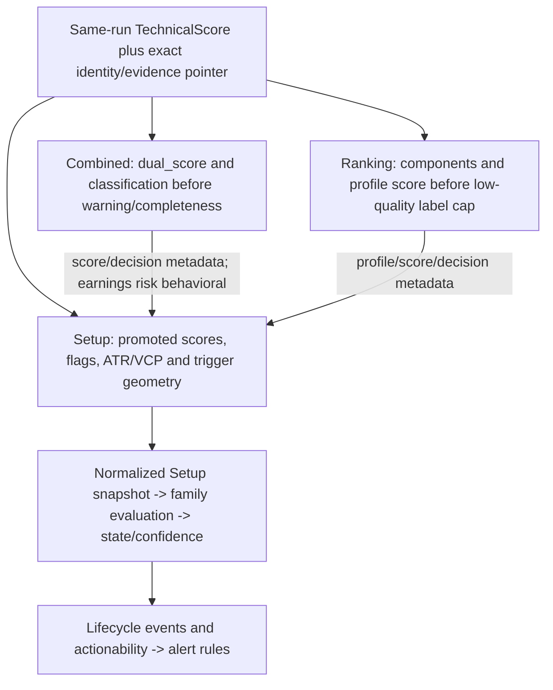

# T12B — Core consumer readiness enforcement

## 1. Executive verdict

PASS for the T12B Technical core graph. Focused consumer, native PostgreSQL, READY parity,
Phase-2 immutable evidence, Phase-1 identity, Phase-0 safety and broad repository lanes
passed. No T12B-scoped consumer bypass remains. This does not certify the deferred
contextual/Winner edges or repository-wide Phase-3 integration.

## 2. Baseline

| Item | Verified value |
|---|---|
| Repository | `C:\Users\Ivica\Documents\SwingLens` |
| Original audited baseline | `3a9d47063be996908b7d5d1cc5769e0bbd033546` |
| Phase-2 certified baseline | `7b015124807b8f895911d7e790fcbf01949ff85f` |
| T12A / starting HEAD | `4c8eb3402b951482d590890e726195a3c445d786` |
| Starting branch | `codex/t12a-readiness-contract-foundation` |
| T12B branch | `codex/t12b-core-consumer-readiness-enforcement` |
| Starting tracked changes | none |
| Starting untracked files | none |
| Starting / final migration head | `0079_setup_lifecycle_alert_ev`, one head |
| Repository Python | CPython 3.12.2, `.venv/Scripts/python.exe` |
| Final commit | focused commit containing this report; SHA recorded in final response |

Both audited and Phase-2 baselines remain authoritative historical anchors. T12B does not
rewrite the original registry into a current-state audit. Unrelated performance worktrees
were preserved. No reset, clean, broad staging, merge or push was performed.

Authority: the lineage registry and synthesis report; Phase-1 identity and Phase-2 immutable
evidence certified snapshots; T11E certification; T12A foundation report and readiness contract.
No replacement readiness architecture was introduced. No AGENTS.md was found in the workspace
or its ancestor directories; no delegation was requested or used.

## 3. Scope

Three direct edges: Technical -> Combined, Technical -> Ranking, Technical -> Setup.
Propagation follows Setup -> Lifecycle -> Alerts. Producer numerics and producer readiness
semantics remain intact. No global low-confidence threshold, new lifecycle state, schema
column, migration, production rewrite or legacy backfill is added.

Winner eligibility, IBMI overlays/CERI inputs, Regime/Sector consumer readiness and other
Technical contextual producers are outside this commit's remediation scope.

## 4. Technical consumer graph

Before-state trace at T12A, verified in current code before editing:



Exact reads and boundaries: `combined_decision._technicals_for_run` ->
`combine_row_decision`; `ranking_profile_service._load_run_inputs` -> `rank_profile` ->
`rank_single_row` -> component extraction/weighting/penalties/gates/sort; Setup source loader ->
snapshot builder -> signal JSON -> episode service -> lifecycle engine/family gateway ->
actionability policy -> existing alert service. Identity compatibility preceded calculations,
but surviving Technical values were not conditioned on the frozen readiness envelope.

Lifecycle does not read TechnicalScore. There is no invented Technical -> Lifecycle SQL edge.
The negative graph remains CERI -> Ranking/Setup/Winner absent; Setup/Lifecycle -> Winner
absent; Sector -> same-run Ranking absent. Phase-1 negative-dependency certification passed.

## 5. Consumer policy model

`TechnicalConsumerPolicy.evaluate` consumes `ProducerReadinessEnvelope` and returns the
T12A immutable typed `ConsumerEligibilityDecision`. Policies have separate stable edge
identities and versions. Additional typed reasons are `PRODUCER_READINESS_BLOCKED` and
`DEGRADED_POLICY_UNDECIDED`; unknown uses the existing `PRODUCER_READINESS_UNKNOWN`.

| Status | All three v1 policies | Effect |
|---|---|---|
| READY | ELIGIBLE | exact frozen Technical values may contribute |
| DEGRADED | POLICY_UNDECIDED | omit decision Technical input |
| INSUFFICIENT_EVIDENCE / ERROR | INELIGIBLE | omit decision Technical input |
| Any blocking reason | INELIGIBLE | blocking cannot be bypassed by status/numerics |
| UNKNOWN / LEGACY_UNKNOWN | POLICY_UNDECIDED | omit; no implicit certification |
| STALE envelope | INELIGIBLE defensively | native Technical staleness NOT_APPLICABLE |

The v1 policies have no configurable override or newly invented confidence/age threshold.
T12A does not emit meaningful Technical STALE; synthetic status tests prove a blocking
envelope cannot be bypassed without inventing native staleness semantics.

## 6. TECHNICAL_TO_COMBINED

Version `technical-to-combined-v1`, consumer `COMBINED`. The policy boundary precedes every
Technical scalar/classification/risk/liquidity behavior. An eligible source is thawed from
its exact immutable evidence payload, with Decimal/date types restored. Mutable positive
values, changed confidence or changed insufficiency flags cannot replace that frozen input.

## 7. Combined behavior before/after

Previously a positive insufficient Technical dual score entered the weighted formula and
could produce a complete candidate. Now the entire Technical behavior input is absent.
The existing `_weighted_available_score`, missing-data penalty, incomplete flags and
missing-input Watchlist label are reused. There is no valid-zero substitution.

Example test configuration: Fundamental 8.8, Technical 8.0, weights .55/.45, missing penalty 1.
READY permits the original 8.44 weighted result. Insufficient Technical contributes nothing:
Fundamental available-weight rescaling yields 8.8, then the existing missing penalty yields
7.8, incomplete/Watchlist. Producer 8.0 remains persisted. Diagnostic warnings may remain
visible without reviving classification penalties or Technical position sizing.

## 8. TECHNICAL_TO_RANKING

Version `technical-to-ranking-v1`, consumer `RANKING`. Eligibility precedes component
extraction, profile normalization, weighting, penalties and gates. Omission produces empty
Technical components and nullable Technical/base scores. Existing available-input scoring
and label caps remain for diagnostics, with explicit `No new entry`.

## 9. Ranking population/normalization behavior

The implementation normalizes components and available weights within each ticker; there
are no peer-derived mean/percentile statistics in this engine. The original audit's broader
population wording is therefore distinguished from the actual code. Cross-ticker behavior
is rank ordering. Rows without usable Technical are retained as incomplete diagnostic
evidence with rank 0 and placed after the rankable population. They receive no actionable rank.

Mandatory contamination regression: A READY score 8 versus B insufficient score 8, followed
by B changed to 9999. A's exact score, components and rank equal A alone. B remains rank 0.
Removing an invalid/missing formerly ranked row can shift a valid peer's ordinal rank; this
is expected remediation, not a score-model regression. All-READY populations retain exact
scores, gates, penalties, labels, hints, ordering and ranks for every configured profile.

Cohort identity/source diagnostics can still pin excluded members. They describe the exact
input inventory and exclusion; they do not let those members contribute numeric statistics.

## 10. TECHNICAL_TO_SETUP

Version `technical-to-setup-v1`, consumer `SETUP`. A separate behavior context substitutes
no Technical artifact when permission is absent, before scores, flags, geometry, ATR/VCP,
trigger signals or confidence are promoted. Original source IDs/identity remain in lineage.

Combined Technical dual-score/classification fallback paths were removed from behavioral
promotion so excluded Technical cannot return through Combined metadata. Combined final
score/decision and Ranking score/decision/profile remain metadata. Combined earnings risk
remains behavioral. CERI is not added as a Setup source.

## 11. Setup actionability

Blocked/undecided Technical produces diagnostic Setup snapshots with INSUFFICIENT quality
and `TECHNICAL_CONSUMER_INELIGIBLE`. Technical values/flags are absent from decision signals;
producer diagnostics remain. Frozen permission in Setup lineage is an independent hard
boundary before family/state/actionability calculations. Ineligible history is omitted from
score velocities and family calculations, rather than resurrecting old numeric remnants.

## 12. Lifecycle propagation

Episode evaluation follows the exact Setup evidence pointer and takes permission from that
frozen lineage. Restoring positive signals or replacing mutable Setup lineage cannot clear
a frozen block. Engine and family gateway abstain before calculating behavioral Technical
signals; actionability adds a hard blocker. No new actionable episode can open.

For an existing episode, the existing no-family-evidence path preserves state/phase and
records blocked current actionability/confidence honestly. The episode service finds the
existing primary family even though unavailable Technical cannot select that family afresh.
Temporal current-episode checks remain. No historical READY evaluation is rewritten and no
automatic rollback state is invented. Existing terminal and independent gap maintenance
rules remain in place. PostgreSQL verifies a previously READY non-generic episode, a new
blocked evaluation, preserved history and no new actionable advancement.

## 13. Alert propagation

The existing alert service consumes lifecycle/actionability results. No invalid
READY/TRIGGERED/CONFIRMED transition is produced, so it cannot announce an invalid actionable
advancement. PostgreSQL exercises the actual alert service and asserts no actionable alert.
Existing diagnostic gate-blocked alerts remain permitted; suppressing all diagnostics would
change alert policy unnecessarily. Old valid transition/alert evidence remains immutable.

## 14. DEGRADED policy decisions

All three edges return POLICY_UNDECIDED and omit Technical. Evidence reviewed:
`confidence_service.build_combined_warning_flags` determines completeness from numeric
availability, not degraded-use authorization; `ranking_profile_gates.apply_profile_gates`
caps low-quality labels only after scoring, the audited defect itself; Setup's coverage and
confidence fallback does not declare permission to consume degraded producer evidence.

No explicit policy granting numeric-use permission was found. Existing post-score behavior
was not relabeled as authorization simply to preserve it. Each edge has its own tested
versioned abstention decision, with native low confidence/warnings retained on the producer.

## 15. UNKNOWN / legacy policy

UNKNOWN and LEGACY_UNKNOWN always remain POLICY_UNDECIDED, never eligible by numeric
existence. Evidence without a reserved readiness member is not renormalized. Missing
referenced evidence or scope/identity mismatches fail explicitly. New calculations do not
promote legacy rows; current-mode presentation may still display their diagnostics.

Unpersisted prospective Technical previews are likewise unsealed and abstain through the
live Setup builder. Read-only discovery becomes incomplete/low confidence; it does not
manufacture preview certification. Post-upstream live evidence remains the runtime decision
source. An explicit certified preview contract would be a separate future change.

## 16. Eligibility evidence persistence

`technical_consumer_eligibility` is frozen in Combined/Ranking debug and Setup source lineage,
inside the Phase-2 immutable consumer payload before hashing. It contains exact producer
readiness, identity/fingerprint and evidence ID plus consumer, policy version, decision and
typed reasons. Exact source edges pin the same Technical evidence. A later recalculation
cannot reinterpret the earlier decision. ORM mutation guards and historical exact readers
remain unchanged.

Same-session Technical recalculation also advances the loaded evidence relationship, avoiding
stale in-memory source reads. PostgreSQL tests original evidence round-trip, projection
movement, same positive numeric with changed readiness, old source pins and deterministic
consumer retry reuse. A test changes all three prospective policy versions to v2 and confirms
that older READY evidence and the frozen blocked v1 Setup keep their original meaning.
Unsupported configurable permission overrides are rejected. No independent mutable
eligibility table is introduced.

PostgreSQL exposed an existing Setup JSON issue: PIT bar manifests contained native dates.
The builder now canonicalizes those manifests before JSON persistence. Canonical hashes and
business values are unchanged; real ORM snapshot persistence now succeeds.

## 17. Ready-input behavior preservation

Committed opt-in tools: `scripts/qa/t12b_behavior_probe.py` and
`scripts/qa/t12b_compare_behavior.py`. A detached T12A worktree ran the identical extended
business probe, with explicit READY scenario/permission fixtures copied for the additional
cross-check. Baseline and T12B each passed 94 tests. The comparison includes full decision
DTO business fields, component/gate/penalty maps, Setup promoted fields, signals and velocities.
Assigned provenance, operational clocks and internal diagnostic evidence are excluded.

195 captures: Combined 32, Ranking populations 13, Setup 23, Lifecycle 95, Actionability 32.
188 are exactly unchanged. Seven are fully accounted expected remediation records, with no
unexpected changes. Twenty dedicated fully READY captures are exactly identical, including
all configured profiles and the actual Setup -> Lifecycle chain under multiple prior states.
Their canonical fingerprint is:
`9554fd4fcabffbb2f0768d9925e912fda5dde9cb9f54d36377f323f748e5bbf5`.

The compare tool also checks that valid rows in mixed Ranking populations retain every
business field except ordinal rank when excluded peers are removed.

## 18. Expected behavior changes

Ineligible/undecided Technical no longer contributes Combined or Ranking numerics or Setup
behavioral signals. Combined becomes incomplete under its existing missing-input formula.
Ranking keeps unranked diagnostics with no entry hint; invalid peers cease to occupy valid
ordinal positions. Setup/Lifecycle abstains and records blocked new evaluations. Unsealed
previews become explicitly incomplete. Producer diagnostics and native numeric zero remain
available; a valid READY zero is not confused with omitted evidence.

No unexpected READY scoring, confidence/state/actionability or profile-model drift remains.

## 19. Static bypass audit

Searches repeated over services for Technical/dual scores, confidence, insufficiency,
readiness/eligibility, profile score, normalization, actionability, triggers and alerts.

| Material path | Classification | Verified boundary / scope |
|---|---|---|
| Technical -> Combined, including classification/liquidity/risk sizing | T12B_ENFORCED | shared permission before formula |
| Technical -> Ranking components/penalties/gates/population | T12B_ENFORCED | shared permission before extraction; excluded rank 0 |
| Technical -> Setup signals/geometry/quality/confidence | T12B_ENFORCED | direct shared policy; no Combined numeric fallback |
| Setup -> episode/lifecycle/family/actionability | T12B_ENFORCED | frozen Setup lineage; residual signals cannot advance |
| Setup history -> family/score velocity | T12B_ENFORCED | Technical-ineligible history omitted |
| Lifecycle -> actionable alert | T12B_ENFORCED | no invalid actionable transition; actual downstream test |
| Winner explicit insufficient Technical exclusion | ALREADY_SAFE for that condition | existing feature extractor; remaining quality T12D |
| Cockpit, score-card, Technical display, result exports/query DTOs | DISPLAY_ONLY | retained diagnostic values grant no permission |
| Unsealed current artifacts/historical legacy presentation | LEGACY_CURRENT | display allowed; certified calculations abstain |
| Prospective Technical reconstruction -> live Setup preview | T12B_ENFORCED / read-only | unsealed input abstains; no artifact promotion |
| IBMI liquidity -> Ranking; volatility/short pressure -> CERI | T12C | existing overlay/feed policies unchanged |
| Regime/Sector -> Setup | T12C | contextual consumer readiness deferred |
| Winner Technical remaining quality and Ranking/Regime/Sector inputs | T12D | no Winner policy implementation changes |
| Technical -> Sector/Regime participation or CERI alignment/context | OUT_OF_SCOPE | contextual producer graph, not three core edges |
| Technical V4/V5/Pine native calculation and parity tools | OUT_OF_SCOPE | producer math/diagnostics retained |
| Generic math/vector functions and unbound state-machine DTOs | OUT_OF_SCOPE | no certified Technical artifact selection |

REMAINING_BYPASS = 0 for the T12B Technical core graph. No eligible-status comparison allows
an undecided artifact to proceed. No missing-envelope branch assumes READY. Producer identity
cohort/source hashing may retain excluded members for provenance; it is not numeric permission.

## 20. Performance/query impact

All three cohort readers explicitly select-in load `TechnicalScore.calculation_evidence`.
Ranking policy evaluation therefore performs no per-ticker/per-profile readiness queries;
select-in loading uses bounded ORM batches. PostgreSQL measures no SELECT during seven
profile calculations after source/evidence preload. Exact single-row calls may follow one
pointer in their owning session. No global latest lookup or broad performance project is added.

## 21. Tests

| Lane | Result | Evidence |
|---|---|---|
| T12B focused | 41 unit cases passed | 37 matrix/core regressions + 4 READY scenarios |
| Combined | 26 module cases passed | full module; golden/schema checks also pass |
| Ranking | 24 cases passed | engine 12 + golden 2 + service 10; peer isolation focused |
| Setup/Lifecycle/Alerts | 265 cases passed | complete subsystem unit suite; actual PostgreSQL propagation |
| T12A foundation | 45 typed cases + PostgreSQL pass | native normalization/status/type/immutability semantics preserved |
| Combined core lane | 401 passed, 1 warning | all above unit modules; zero skips/deselections |
| Phase-2 plus readiness/consumer PG | 62 passed, 19 warnings | nine integration modules; fresh/install/downgrade/reupgrade/drift |
| Phase-1 | 134 passed, 1 warning | six identity/adoption/certification modules |
| Phase-0 | 141 passed, 40 warnings | fencing/temporal/preflight/publication + three PG modules |
| Final policy-version/config check | 38 passed, 2 warnings | focused 37 + native PostgreSQL; later version changes cannot reinterpret evidence |
| READY baseline/current comparison | 94 passed each, 1 warning each | 195 captures; 20 dedicated READY exact matches |
| Broader repository | 2660 passed, 7 deselected, 22 warnings | native unit/repository lane described below; zero failures/skips |
| Static gates | passed | Ruff app/tests/scripts; compileall; diff check; single Alembic head |

Lanes overlap; counts are not unique-test totals. The broad command is:

```text
.venv/Scripts/python.exe -m pytest tests --ignore=tests/integration --ignore=tests/e2e
  --ignore=tests/test_migration_remediation.py --ignore=tests/qa/test_qa_infrastructure.py
  -m 'not external and not e2e' -q -ra
```

The QA infrastructure self-test and external/browser lanes are outside the native broad
lane, not suppressed failing readiness cases. Relevant PostgreSQL tests run separately with
the named disposable admin URL. No new skip/xfail or deselection was added to readiness tests.

Initial fixture failures were resolved by declaring genuine READY preconditions and freezing
their evidence at fixture creation. Later source mutations require explicit resealing.
Unknown/legacy/degraded/error/insufficient inputs remain as adversarial regressions. The old
shadow-display test now compares the full business DTO independently of assigned evidence
provenance. No assertion asserting unsafe Technical permission was retained as a golden result.

Interim helper-construction and PostgreSQL fixture reference errors were corrected. The actual
PIT JSON date defect and frozen Decimal/date restoration were fixed in implementation. All final
lanes have zero failed/skipped tests. Broad deselections are seven existing external/e2e
marked cases, outside this native lane. No readiness case is deselected.
Warning classes are existing Starlette/httpx, Alembic path splitting and Python sqlite datetime
adapter deprecations. There is no observed flaky test.

Disposable PostgreSQL 16 uses task-owned container `swinglens-t12b-pg-20260916`, loopback port
55432 and individually guarded `swinglens_pytest_*` databases. No authoritative database was
used. Test databases and container are removed after certification; existing monitoring
containers and unrelated worktrees are preserved. QA logs/captures stay ignored in `.qa_work`.

## 22. Finding reconciliation

| Finding | T12B result | Exact limit |
|---|---|---|
| CORE-009 | CLOSED_FOR_CORE_CONSUMER_ACTIONABILITY; numeric-remnant existence retained | Technical diagnostics intentionally remain; repository-wide producer contexts not claimed |
| RANK-001 | CLOSED for Technical -> Combined/Ranking | all non-permitted native statuses abstain before numeric use |
| RANK-002 | CLOSED for core Technical population/rank behavior | no invalid components, peer contribution or valid rank; other overlay quality T12C |
| SETUP-003 | CLOSED for Technical -> Setup -> Lifecycle -> actionable Alerts | Regime/Sector readiness remains separate T12C work |
| WIN-004 | UNTOUCHED / DEFERRED T12D | existing insufficiency gate remains; no Winner policy edits |
| XINT-004 | PARTIAL | IBMI and contextual/cross-consumer edges remain |
| INV-READINESS-001 | ENFORCED for Technical core edges; PARTIAL repository-wide | T12C/D/E not certified here |

## 23. Residual Phase-3 risks

IBMI liquidity and CERI volatility/short-pressure consumers still lack complete readiness
permission propagation. Regime/Sector -> Setup and Winner contextual quality remain deferred.
Other Technical contextual producers are outside the three-edge certification. Producer
diagnostic numerics remain intentionally present. Unsealed previews are conservative, not
certified forecast evidence. Privileged direct SQL/bulk mutation remains the Phase-2 ORM
boundary governance limitation, not a certified historical rewrite path.

## 24. T12C candidates

IBMI liquidity -> Ranking; IBMI volatility/short pressure -> CERI; Regime/Sector -> Setup.
Use exact frozen producer envelopes with native coverage/freshness/confidence and separately
versioned consumer permission. Do not create CERI -> Setup or Sector -> same-run Ranking.

## 25. T12D candidates

Winner's remaining Technical quality policy and exact Ranking/Regime/Sector readiness
permission, preserving its independent graph. No Setup/Lifecycle/CERI -> Winner dependency.
T12E owns integrated Phase-3 certification and reconciliation of remaining scope.

## 26. Final verdict

PASS. All required native consumer, PostgreSQL, READY parity, Phase-2, Phase-1, Phase-0,
broad and static gates passed. The three Technical consumer boundaries and downstream
Setup/Lifecycle/actionable-alert propagation have no material T12B bypass. Producer
diagnostic numerics, T12A normalization semantics and historical consumer meaning remain
intact. No schema migration, production rewrite or legacy backfill is required.

The task-owned comparison worktree and PostgreSQL container were removed after verifying
that no disposable test databases remained. Existing monitoring containers and unrelated
worktrees were preserved. This report and architecture update are included in the one
explicitly staged commit `fix: enforce technical readiness across core consumers`;
the final commit SHA is reported outside its own contents. No merge or push occurs.

Phase-3 remains partial beyond this scope: T12C contextual consumers, T12D Winner and
cross-consumer permissions, and T12E integration certification remain deferred.
