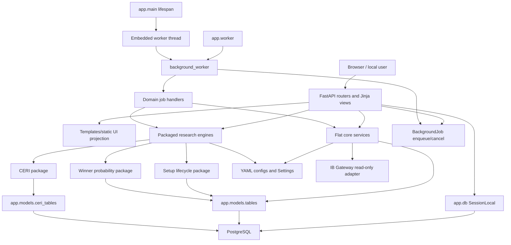

# Phase 2 - Architecture, Modularity, and Dependency Direction Review

Review date: 2026-08-02

## Objective

Assess whether SwingLens' architecture supports safe evolution of a rapidly growing codebase.

## Executive Summary

Phase 2 is amber/red.

The system has a recognizable FastAPI architecture and a useful service-oriented direction. The
newer research engines, especially CERI, setup lifecycle, and winner probability, are packaged with
domain configs, DTOs, query services, repositories, job handlers, and tests. The full application
imports, the app factory is testable, and the architecture-adjacent regression slice passed.

The structural risk is that the codebase has grown past the original flat architecture. The shared
ORM model module is a central dependency for almost everything, several routers contain business
workflow and persistence behavior, global settings/database objects are created at import time,
background worker and job-handler modules form dependency cycles, and older scoring/config/UI
projection code does not consistently use the stronger boundary patterns adopted by newer domains.

## Evidence Log

| Evidence | Result |
| --- | --- |
| Phase 2 checklist from `C:/Users/Ivica/Downloads/software_review_plan.md` | Reviewed objective, activities, outputs, and exit criteria. |
| Module inventory | `210` Python modules under `app`, with `652` internal import edges. |
| Package size summary | Standalone `app.services`: 81 files / 18,855 lines; CERI: 45 / 8,215; setup lifecycle: 28 / 8,106; winner probability: 32 / 7,830; routers: 12 / 5,778; models: 5 / 3,535. |
| Largest modules | `app/models/tables.py` 2,687 lines, `app/routers/run_routes.py` 1,833, `app/services/pine_replica_engine.py` 1,213, `app/routers/ceri_routes.py` 1,059, `app/services/setup_lifecycle/repository.py` 1,028. |
| Import graph | Top incoming dependencies: `app.models.tables` imported by 88 modules, `app.models.ceri_tables` by 30, settings by 19. |
| Circular dependency scan | 8 cycles found: worker/job-handler cycles and setup lifecycle family-adapter cycles. |
| Route persistence scan | Routers directly call `select`, `db.commit`, `db.rollback`, `db.get`, `db.scalar`, or `db.scalars` in many routes. |
| Import-time side-effect scan | `app.__init__` creates an event loop; `get_settings()` creates dirs; `app.db` creates engine/session globals from cached settings. |
| App/worker lifecycle | `app/main.py` includes route introspection, static mounting, and optional embedded worker thread startup. |
| Regression slice | `uv run pytest tests/test_app_lifespan_worker.py tests/test_background_worker.py tests/test_background_job_service.py tests/test_pipeline_service.py tests/test_pipeline_executor.py tests/test_schema_phase2.py tests/test_settings.py -q` -> `82 passed, 1 warning in 5.17s`. |

The warning is the existing Starlette/httpx `TestClient` deprecation warning.

## Current-State Architecture Diagram

## Dependency-Rule Proposal

| Layer | May depend on | Must not depend on |
| --- | --- | --- |
| `app.main` | routers, settings, worker launcher, templates/static mounting | domain services beyond worker bootstrap |
| routers | request/response schemas, service facades, query services, authorization dependencies | raw SQL for nontrivial queries, direct domain mutation workflows, private service helpers |
| service facades | repositories, domain engines, DTOs, settings/config snapshots | FastAPI `Request`, templates, route helpers |
| query/projection services | ORM models, read-only query helpers, DTO/view models | state-changing workflows, template rendering |
| repositories | ORM models and SQLAlchemy session | FastAPI, settings globals where possible, UI DTOs |
| domain engines | config DTOs, pure inputs, pure helpers | SQLAlchemy session, FastAPI, filesystem |
| provider adapters | provider protocols, settings/config, DTOs | routers, templates, unrelated domain models |
| job handlers | background job protocol, domain service facades | `background_worker` implementation details |
| models/migrations | SQLAlchemy primitives and frozen migration definitions | live application services inside migrations |
| config loaders | typed config DTOs and path inputs | route/request state, hidden current-working-directory dependence |

## Findings Register

### PH2-001 - Shared ORM model module is a central dependency and migration drift source

Severity: S1 High
Confidence: Confirmed

Affected components: `app/models/tables.py`, `app/models/ceri_tables.py`, migrations, most services
and routers.

Evidence: Import graph shows `app.models.tables` is imported by 88 modules and is 2,687 lines.
`app.models.ceri_tables` is imported by 30 modules. Phase 4 and Phase 21 confirm clean Alembic
upgrade fails because historical migrations imported live ORM metadata that drifted.

Reproduction steps: Inspect import graph, then run the Phase 21 clean migration probe.

Expected behavior: Domain persistence models and historical migrations should have stable ownership
and limited blast radius.

Observed behavior: Shared table metadata is a hub for core, market, sector, setup lifecycle, winner
probability, and jobs; historical migrations can change behavior when live models change.

Impact: Small model changes can affect many domains and break clean installs or restore paths.

Root cause or likely cause: The MVP started with one shared table module; later engines added large
schema surfaces before persistence ownership was split.

Recommended remediation:

- Split domain tables into owned modules: core, jobs/pipeline, market/sector, setup lifecycle,
  winner probability, and CERI.
- Keep `app.models.__init__` as a metadata import aggregator only.
- Rewrite migrations that import live application models into frozen Alembic operations.
- Add static migration lint rejecting `from app.models` imports in revision files.

Acceptance criteria: Clean PostgreSQL upgrade passes, and table ownership is discoverable from
module names and CODEOWNERS.

Regression tests required: Clean PostgreSQL migration CI, metadata import smoke, migration static
lint.

Owner profile: Backend/database owner.

Dependencies: Phase 4 migration remediation and Phase 20 CODEOWNERS/versioning work.

### PH2-002 - Route layer contains business workflow and direct persistence logic

Severity: S1 High
Confidence: Confirmed

Affected components: `app/routers/run_routes.py`, `app/routers/ceri_routes.py`,
`app/routers/setup_lifecycle_routes.py`, `app/routers/winner_probability_routes.py`,
`app/routers/sector_rotation_routes.py`, `app/routers/market_regime_routes.py`,
`app/routers/ib_routes.py`.

Evidence: `run_routes.py` is 1,833 lines and imports 22 service modules. Routers directly call
`select`, `db.commit`, `db.rollback`, `db.get`, `db.scalar`, and `db.scalars` across many route
files. `run_routes.py` also contains run detail context builders for winner probability, setup
lifecycle, CERI, chart context, fetch status, and pipeline status.

Reproduction steps: Run the route persistence scan:
`rg -n "db\\.(add|delete|commit|rollback|flush|get|scalar|scalars|execute)\\(|select\\(" app\\routers`.

Expected behavior: Routers should coordinate HTTP concerns and delegate domain workflows and
read-model construction to service/query layers.

Observed behavior: Older routers own commits, rollback behavior, query composition, orchestration,
and UI projection helpers.

Impact: Behavior is harder to test outside HTTP, security/CSRF guards are harder to centralize, and
shared workflows can drift between HTML and API routes.

Root cause or likely cause: Early MVP routes accumulated orchestration before newer package
patterns existed.

Recommended remediation:

- Create `RunCommandService`, `RunQueryService`, and `RunDetailProjectionService`.
- Move route helper functions that query or compose domain contexts into query/projection services.
- Give routers one transaction pattern: call command service, commit through a shared unit of work
  or service boundary, map exceptions to responses.
- Prioritize POST/admin routes first because Phase 15 security remediation will touch them anyway.

Acceptance criteria: `app/routers/run_routes.py` falls below 700 lines and contains no raw SQL
except trivial existence checks, or the checks are documented exemptions.

Regression tests required: Characterization tests for current route responses, redirects, status
codes, commits/rollbacks, and error mapping before extraction.

Owner profile: App/backend owner.

Dependencies: Phase 15 route guard work and Phase 16 UI characterization.

### PH2-003 - Import-time globals create hidden filesystem, DB, and event-loop side effects

Severity: S1 High
Confidence: Confirmed

Affected components: `app/__init__.py`, `app/asyncio_compat.py`, `app/settings.py`, `app/db.py`,
`app/main.py`, tests.

Evidence: Importing `app` runs `ensure_event_loop()` (`app/__init__.py:3-5`). `get_settings()` is
cached and calls `ensure_local_dirs()`, which creates upload/export/cache directories
(`app/settings.py:92-101`). `app/db.py` calls `get_settings()` and creates global `engine` and
`SessionLocal` at import time (`app/db.py:13-15`). `app/main.py` also creates a module-level
`settings = get_settings()` (`app/main.py:27`).

Reproduction steps: Import `app.db` in a clean environment and observe settings resolution, local
directory creation, and engine construction.

Expected behavior: Importing modules should be cheap and side-effect-light; app factories should
own runtime initialization.

Observed behavior: Settings, filesystem directories, event loop, and database engine are initialized
before an app instance or worker mode is explicitly chosen.

Impact: Tests must work around cached settings; alternate deployment modes and clean import
introspection can accidentally touch filesystem or bind to the wrong database URL.

Root cause or likely cause: Local-only MVP convenience was favored over explicit lifecycle
construction.

Recommended remediation:

- Move directory creation to startup/readiness or an explicit bootstrap function.
- Replace global `engine`/`SessionLocal` with a database factory stored on `app.state` and a worker
  bootstrap equivalent.
- Keep `get_settings()` pure, cached, and side-effect-free.
- Remove package-level event loop creation or scope it to IB code that requires it.

Acceptance criteria: Importing `app`, `app.db`, and routers does not create directories or database
engines; tests can instantiate multiple app settings without cache mutation surprises.

Regression tests required: Import-side-effect tests using temporary CWD and patched env vars.

Owner profile: App/platform owner.

Dependencies: Worker topology ADR and settings validation from Phase 3.

### PH2-004 - Background worker and domain job handlers form dependency cycles

Severity: S2 Medium
Confidence: Confirmed

Affected components: `app/services/background_worker.py`, `app/services/ceri/job_handlers.py`,
`app/services/setup_lifecycle/job_handlers.py`, `app/services/winner_probability/job_handlers.py`.

Evidence: Cycle scan found:

- `background_worker -> setup_lifecycle.job_handlers -> background_worker`
- `background_worker -> winner_probability.job_handlers -> background_worker`
- `background_worker -> ceri.job_handlers -> background_worker`

Domain job handlers import `CancelRequested` from `background_worker`, while `default_job_handlers`
imports the domain handler registries.

Reproduction steps: Run the AST cycle scan from this review.

Expected behavior: Domain job handlers should depend on a small background-job protocol/contracts
module, not the concrete worker implementation.

Observed behavior: `CancelRequested`, handler type, default registry construction, and execution
loop live together in `background_worker.py`.

Impact: Adding new job families or running workers separately can increase cycle pressure and make
import behavior harder to reason about.

Root cause or likely cause: The worker started small, then domain job registration grew into it.

Recommended remediation:

- Extract `JobHandler`, `CancelRequested`, and handler result contracts to
  `app/services/background_job_contracts.py`.
- Move default registry assembly to `app/services/job_registry.py`.
- Let worker accept injected handlers by default from registry, while domain packages only depend on
  contracts.

Acceptance criteria: Cycle scan shows no worker/domain cycles.

Regression tests required: Existing background worker/job handler tests plus an import-cycle test.

Owner profile: Operations/backend owner.

Dependencies: Phase 14 duplicate-job/idempotency remediation.

### PH2-005 - Setup lifecycle adapter registry has circular helper/adapter dependencies

Severity: S2 Medium
Confidence: Confirmed

Affected components: `app/services/setup_lifecycle/family_adapters.py`,
`breakout_adapter.py`, `pullback_adapter.py`, `vcp_adapter.py`, `continuation_adapter.py`,
`generic_adapter.py`.

Evidence: Cycle scan found five cycles from `family_adapters` to concrete adapters and back.
Concrete adapters import helper functions from `family_adapters`, while `family_adapters` imports
concrete adapter classes inside registry functions.

Reproduction steps: Run the AST cycle scan from this review.

Expected behavior: Adapter helpers, adapter protocol, and adapter registry should be separate.

Observed behavior: One module serves as protocol, helper library, and registry.

Impact: Adding setup families is still straightforward, but registry/helper coupling will get
fragile as family logic grows.

Root cause or likely cause: Shared helper functions and registry code were colocated for speed.

Recommended remediation:

- Split `family_adapters.py` into `adapter_contracts.py`, `adapter_helpers.py`, and
  `adapter_registry.py`.
- Concrete adapters import only contracts/helpers.
- Registry imports concrete adapters and returns enabled instances.

Acceptance criteria: Adding a new family requires one adapter module plus registry registration,
with no helper import cycle.

Regression tests required: Existing family adapter tests plus registry ordering/selection tests.

Owner profile: Setup lifecycle owner.

Dependencies: None.

### PH2-006 - Extension points are inconsistent across domains

Severity: S2 Medium
Confidence: Strong

Affected components: provider adapters, scoring engines, ranking profiles, setup families, job
handlers, config loaders.

Evidence: CERI has an explicit provider protocol/registry and provider package. Setup lifecycle has
a protocol-like family adapter pattern but cyclic registry/helpers. Ranking profiles are
configuration-driven. Worker job handlers are registry-like but assembled inside the worker.
Older scoring engines use function calls and YAML loaders directly from services. Config loading is
typed for newer engines and weaker/flat for older core scoring.

Reproduction steps: Compare CERI provider registry, setup lifecycle family registry, ranking profile
config, background worker `default_job_handlers`, and core scoring config loaders.

Expected behavior: Extension points should share clear contracts, registration mechanics, and
versioning rules.

Observed behavior: Each domain invented a local extension style.

Impact: New providers, scoring versions, setup families, and job handlers require domain-specific
knowledge and are hard to govern uniformly.

Root cause or likely cause: Features were implemented incrementally, with newer subsystems improving
patterns without back-porting them to older layers.

Recommended remediation:

- Standardize extension contracts:
  - provider protocol and registry,
  - scoring engine protocol with calculation/config/export schema versions,
  - job handler contract and registry,
  - setup-family adapter contract and registry,
  - export schema registry.
- Document versioning and ownership rules in ADRs and `docs/versioning.md`.

Acceptance criteria: New extension implementations can be added without importing routers or shared
implementation helpers, and each carries version/config lineage.

Regression tests required: Contract tests for provider/scoring/job/setup/export registries.

Owner profile: Architecture/maintainer lead.

Dependencies: Phase 20 governance/versioning remediation.

## Architectural Hotspots Ranked By Change Risk

| Rank | Hotspot | Risk | Why it matters |
| --- | --- | --- | --- |
| 1 | Alembic + live ORM model imports | S0/S1 | Clean install/recovery is broken and future model edits can mutate migration history. |
| 2 | State-changing routers with direct DB commits | S0/S1 | Phase 15 security guard work must touch these paths; behavior can drift per route. |
| 3 | `app/models/tables.py` central hub | S1 | 88 incoming imports and 2,687 lines make persistence changes high blast-radius. |
| 4 | Import-time settings/DB/filesystem globals | S1 | Alternate settings, tests, workers, and clean imports are fragile. |
| 5 | `run_routes.py` | S1/S2 | It mixes HTTP, orchestration, domain read models, actions, and UI projection. |
| 6 | Embedded worker topology | S2 | Convenient local mode, but deployment/observability/readiness need separate worker semantics. |
| 7 | Job-handler registry cycles | S2 | Domain job additions depend on worker implementation details. |
| 8 | Setup lifecycle adapter cycles | S2 | Family extension is easy today but structurally tangled. |
| 9 | Mixed config/DTO patterns | S2 | Newer domains are typed and hashed; older scoring remains less governed. |
| 10 | Export/UI projection scattered across routers/services | S2 | Evidence/provenance and redaction consistency are harder to enforce. |

## Refactoring Epics With Safe Sequencing

### Epic A - Stabilize persistence and migrations

1. Add clean PostgreSQL migration CI/probe.
2. Rewrite live-model migrations into frozen Alembic definitions.
3. Split ORM table ownership by domain while preserving `Base.metadata` aggregation.
4. Add migration import lint.

Characterization tests: clean upgrade, current DB upgrade, metadata import smoke, schema tests.

### Epic B - Make runtime initialization explicit

1. Make `get_settings()` side-effect-free.
2. Move directory creation to startup/readiness/bootstrap.
3. Add a database factory and store engine/session factory in app/worker state.
4. Remove package-level event-loop creation or narrow it to IB runtime bootstrap.

Characterization tests: import side-effect tests, app factory with two settings objects, worker
session factory injection.

### Epic C - Extract route command/query/projection services

1. Start with state-changing routes touched by Phase 15 CSRF/local-admin remediation.
2. Extract run detail context builders from `run_routes.py`.
3. Move direct SQL from routers into query services.
4. Standardize command return DTOs and error mapping.

Characterization tests: route response snapshots, redirect/status/error tests, commit/rollback
tests, export route fixtures.

### Epic D - Decouple worker contracts and registries

1. Extract `CancelRequested` and `JobHandler` contract.
2. Move handler assembly to `job_registry.py`.
3. Domain packages register handlers through their own public registry functions.
4. Add separate web/worker deployment docs and readiness checks.

Characterization tests: existing background worker suite, domain job handler suites, cycle scan.

### Epic E - Standardize extension and version contracts

1. Define scoring/provider/job/setup/export registry contracts.
2. Back-port typed config/hash patterns to core scoring.
3. Add version bump rules and CODEOWNERS for extension points.
4. Add contract tests for new implementations.

Characterization tests: config hash stability, golden fixtures, provider protocol tests, scoring
version tests.

## Test Additions Proposal

| Test | Purpose |
| --- | --- |
| Import side-effect test | Import `app`, `app.db`, routers, and services under temp CWD/env and assert no dirs/engine are created unless bootstrap is called. |
| Import cycle test | AST/import-linter check for forbidden cycles and layer violations. |
| Router SQL/commit lint | Flag raw SQLAlchemy and transaction calls in routers except documented allowlist. |
| Migration import lint | Reject `from app.models` in Alembic revision files. |
| App factory isolation test | Create two apps with different settings and assert DB/session/static/worker config does not leak through cached globals. |
| Worker topology test | Run web app with worker disabled and external worker with injected settings/session factory. |
| Extension registry contract tests | Providers, scoring engines, job handlers, setup families, and exports must register with version/owner metadata. |

## ADR Proposals

| ADR | Decision |
| --- | --- |
| ADR-PH2-001 | Worker topology: embedded local worker plus supported external worker mode, readiness semantics, and deployment boundary. |
| ADR-PH2-002 | Configuration lifecycle: settings are pure, startup validates and creates runtime resources, run-level config snapshots are immutable. |
| ADR-PH2-003 | Quantitative-engine versioning: calculation/config/export/model schema versions and golden-governance rules. |
| ADR-PH2-004 | Persistence ownership: domain table modules, frozen migrations, and repository/query service boundaries. |
| ADR-PH2-005 | Router boundary: routers handle HTTP/auth/rendering only; services own workflows and transactions. |

## Phase Scorecard

| Dimension | Rating | Rationale |
| --- | --- | --- |
| Module organization | Amber | New domains are packaged; older/core services and shared models remain flat and large. |
| Dependency direction | Amber/Red | Most imports flow routers -> services -> models, but worker/domain and adapter cycles exist. |
| Import-time side effects | Red | Settings, local dirs, DB engine, and event loop are created through imports/cached globals. |
| Router/service separation | Red | Multiple routers contain direct persistence and workflow logic. |
| Optional engine boundaries | Amber | CERI/SLSE/OWPE are separated by package and flags, but shared models/config/jobs couple them. |
| Extension points | Amber | Good local patterns exist, but no uniform registry/version contract. |
| Worker deployment topology | Amber/Red | Embedded worker is tested and convenient; external worker/readiness semantics need an ADR. |
| Test isolation | Amber | Tests pass and injection exists in places, but import-time globals and fake DB dependence remain risks. |

## Action Backlog

Immediate:

- Repair clean migration failure and remove live ORM imports from historical migrations.
- Add central route guard work in a way that also extracts state-changing route command services.
- Make settings/local-dir/database initialization explicit enough for test and deployment isolation.

Near-term:

- Extract worker contracts and job registry to remove cycles.
- Split setup lifecycle adapter helpers/contracts/registry.
- Extract run route query/projection services.
- Add architecture lint tests for migration imports, import cycles, and router persistence.

Structural:

- Split domain table ownership.
- Standardize provider/scoring/job/setup/export extension contracts.
- Add ADRs for worker topology, config lifecycle, quantitative-engine versioning, persistence
  ownership, and router boundaries.
- Back-port typed config and version/hash patterns to older core scoring.

## Exit Report

Passed checks:

- Phase 2 plan section reviewed.
- Module inventory, import graph, file-size inventory, side-effect scan, router persistence scan, and
  cycle scan completed.
- Architecture-adjacent regression suite passed: `82 passed, 1 warning`.
- Critical dependency violations and import-time side effects are documented.
- Structural recommendations include behavior-preserving migration paths and characterization tests.

Failed checks:

- Clean architecture dependency direction is not enforced.
- Import-time side effects exist in settings, database, and package initialization.
- Routers still own significant business workflow and direct persistence behavior.
- Worker/domain and setup adapter cycles exist.
- Shared ORM metadata remains a high-blast-radius architectural hub.

Deferred items:

- Implementing architecture lint in CI.
- Splitting ORM modules and routers.
- Worker topology ADR and external-worker readiness implementation.
- Full dependency graph visualization in generated artifact form.

Phase 2 status: architecture is service-oriented enough to keep evolving locally, but it needs
explicit boundaries, side-effect-free initialization, migration repair, and route/service extraction
before the larger optional research engines can be maintained safely.
